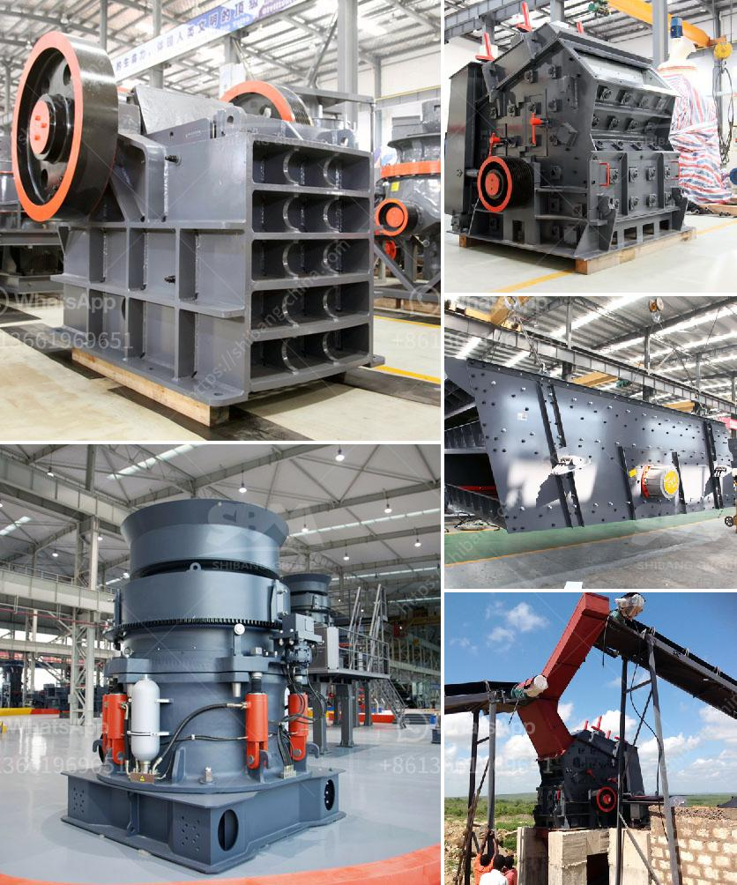

<h3>crushing complete crushing plant 150tph 200tph</h3>
With the rising demand for construction materials, the need for efficient crushing plants is on the rise. One such solution that is being adopted by many companies is the crushing complete plant 150tph-200tph. This plant ensures high productivity and efficiency while crushing various types of stones and rocks.

The crushing complete plant 150tph-200tph is equipped with a primary jaw crusher, secondary cone crusher, tertiary vertical shaft impact crusher, vibrating feeder, vibrating screen, and belt conveyors. The plant crushes a wide range of materials from hard rock to soft rock, ensuring high-quality end products.

The primary jaw crusher, which is the heart of the plant, has a large feed opening. It can handle even the toughest materials, such as granite and basalt. The jaw crusher is designed with a heavy-duty construction to withstand the harsh working conditions in a quarry or mining site.

Once the materials pass through the primary crusher, they are then processed by the secondary cone crusher. This cone crusher is designed to produce high-quality end products with accurate particle size distribution. It ensures that the aggregates produced meet the required specifications for construction projects.

To further enhance the quality of the end products, the plant is equipped with a tertiary vertical shaft impact crusher. This crusher uses the principle of rock-on-rock crushing to produce cubical-shaped aggregates. It is known for its high production capacity and low operating cost.

The vibrating feeder plays a crucial role in the plant's productivity. It evenly feeds the material into the jaw crusher, ensuring a continuous flow of material and preventing any clogging or blockage. The vibrating feeder is designed to withstand heavy loads and operate continuously, ensuring smooth and efficient feeding of the crusher.

The vibrating screen separates the crushed materials into different sizes. This helps in achieving the desired particle size distribution of the end products. The screen has multiple decks to accommodate various sizes of aggregates, allowing flexibility in product customization.

To ensure smooth operation and minimal downtime, the plant is equipped with a comprehensive control system. It monitors and controls all the plant's functions, such as crusher settings, feed rates, and conveyor belt speeds. This control system also provides real-time data and diagnostic information, allowing operators to optimize the plant's performance.

In conclusion, the crushing complete plant 150tph-200tph is a practical and efficient solution for companies involved in the construction materials industry. It offers a wide range of benefits, including high productivity, high-quality end products, and minimal downtime. With its advanced features and robust construction, this plant is capable of handling even the toughest materials. Whether for road construction, building construction, or infrastructure projects, this crushing plant is a reliable and productive solution.
<h3>Contact us</h3><ul><li><strong>Whatsapp:&nbsp;<a href="https://wa.me/8613661969651">+8613661969651</a></strong></li><li><a href="https://swt.shibang-china.com/?git&amp;zhl&amp;crushing complete crushing plant 150tph 200tph"><strong>Online Service(chat now)</strong></a></li></ul><h3>Related</h3><ul><li><a href='used vertical grinder mill for sale.md'>used vertical grinder mill for sale</a></li><li><a href='ball mill inching drive.md'>ball mill inching drive</a></li><li><a href='hammer mill for sale ebay.md'>hammer mill for sale ebay</a></li><li><a href='rock crusher 500 cubic metre per day.md'>rock crusher 500 cubic metre per day</a></li><li><a href='models of stone crushers in malaysia.md'>models of stone crushers in malaysia</a></li></ul>