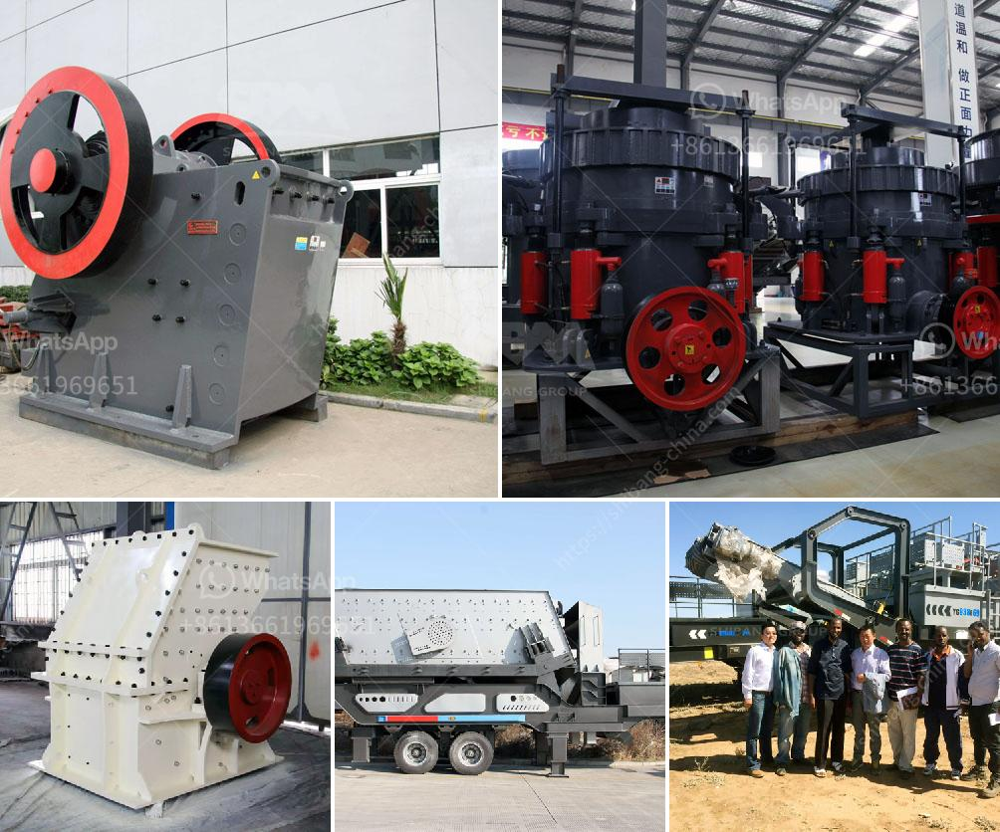

<h3>crushing construction waste crusher</h3>
Construction waste is becoming a major issue worldwide. As population growth and urbanization continue to rise, so does the amount of waste generated from building and demolition activities. The improper disposal of this waste poses significant environmental and health risks. However, with the advent of crushing construction waste crushers, sustainable waste management has become achievable.

Construction waste includes a variety of materials such as concrete, bricks, metals, wood, and plastics. These materials are often discarded in landfills, leading to increased greenhouse gas emissions and resource depletion. Moreover, traditional disposal methods contribute to soil and water pollution, undermining the integrity of surrounding ecosystems.

To address this mounting concern, a crushing construction waste crusher offers an efficient and sustainable solution. This equipment comes in various sizes, ranging from compact to heavy-duty machines, and utilizes mechanical force to break down construction waste into smaller particles for reuse and recycling.

One of the main advantages of this crusher is that it reduces the volume of waste. Large amounts of debris can be processed through the crusher, significantly reducing the need for additional landfill space. This not only saves the environment but also lowers the cost of waste disposal and transportation.

Another benefit of the construction waste crusher is the opportunity for material recycling. The broken-down waste can be used as aggregates in the production of new concrete or road base materials, reducing the demand for virgin resources. By recycling these materials, the need for extraction and processing of natural resources is minimized, leading to a more sustainable and circular economy.

Additionally, the crusher separates different types of construction waste, such as concrete, metals, and wood, allowing for targeted recycling. Metals can be melted down and reused, reducing the need for energy-intensive metal production. Wood waste can be transformed into wood chips or used for biomass energy production. With the help of a construction waste crusher, these materials can be effectively repurposed.

Apart from environmental benefits, crushing construction waste crushers also provide economic advantages. By recycling and reusing the waste, construction companies can reduce their disposal expenses and potentially earn revenue from selling recycled materials. Additionally, the use of recycled materials in construction projects can lower the overall construction costs, making it an appealing solution for developers.

In conclusion, crushing construction waste crushers have emerged as a vital tool in sustainable waste management. These machines crush construction waste into smaller particles, reducing its volume and enabling recycling and reuse. By diverting waste from landfills and promoting material recycling, these crushers contribute to a more sustainable and circular economy. Moreover, they offer economic benefits to construction companies and help in achieving environmental goals. To tackle the mounting construction waste problem, it is essential to adopt crushing construction waste crushers as a solution for long-term sustainable waste management.
<h3>Contact us</h3><ul><li><strong>Whatsapp:&nbsp;<a href="https://wa.me/8613661969651">+8613661969651</a></strong></li><li><a href="https://swt.shibang-china.com/?git&amp;zhl&amp;crushing construction waste crusher"><strong>Online Service(chat now)</strong></a></li></ul><h3>Related</h3><ul><li><a href='difference between primary and secondary jaw crusher.md'>difference between primary and secondary jaw crusher</a></li><li><a href='double roller stone cracher.md'>double roller stone cracher</a></li><li><a href='tons per day ball mill.md'>tons per day ball mill</a></li><li><a href='equipment required for producing lime for new plant.md'>equipment required for producing lime for new plant</a></li><li><a href='looking for used pulverizer machine.md'>looking for used pulverizer machine</a></li></ul>