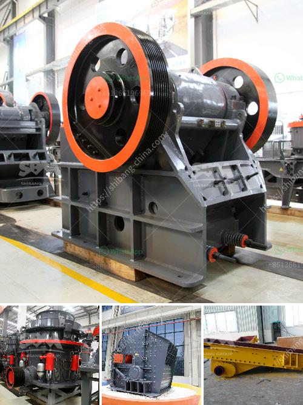

<h3>crushing equipment aggregates crushing</h3>
The demand for aggregates is constantly increasing in the construction industry, and the need for efficient and reliable crushing equipment has become crucial. The process of crushing aggregates involves the use of high-quality machinery to break down and reduce the size of rocks and other materials. This article will delve into the world of aggregates crushing and explore the importance of utilizing advanced equipment in this process.

Aggregates are essential components used in various construction projects, including roads, bridges, buildings, and railway tracks. They can be natural materials such as gravel, crushed stone, sand, or artificial materials like recycled concrete or slag. The primary objective of aggregates crushing is to produce materials of specific sizes and shapes that meet the requirements and specifications of different construction projects.

To achieve this, it is essential to have robust and efficient crushing equipment. One popular machine used for aggregates crushing is a jaw crusher. This equipment utilizes a compression force to break down the materials into smaller pieces. The feed material enters the crushing chamber and is squeezed between two jaw plates, reducing its size.

Another commonly used machine is the impact crusher. This machine uses a high-speed rotor to strike and shatter the materials, producing aggregates with more cubical shapes. It is particularly useful for producing materials with a higher fines content, which is suitable for asphalt and concrete production.

In addition to jaw and impact crushers, there are also cone crushers available for aggregates crushing. These crushers utilize a rotating cone-shaped mantle that gyrates around the inside of a concave bowl, forcing the materials against the mantle to break them down. Cone crushers are known for their high-efficiency and capability to produce high-quality aggregates with excellent particle shapes.

When it comes to choosing the right crushing equipment, several factors need to be considered. The type of material being crushed, the desired product size, and the production capacity are crucial parameters to evaluate. Each machine has its unique advantages and is suitable for different applications and specific requirements.

Furthermore, utilizing advanced technology in crushing equipment has become essential to improve efficiency and productivity. Many modern crushers are equipped with automated features such as remote control operation, hydraulic adjustment systems, and intelligent monitoring systems. This not only reduces human intervention but also enhances safety and allows for better process control.

Environmental sustainability is also a significant concern in the aggregates crushing industry. Advanced equipment is designed to minimize dust and noise emissions, ensuring a cleaner and more sustainable working environment. Additionally, many crushers are equipped with state-of-the-art technology for efficient energy consumption, reducing the overall impact on the environment.

In conclusion, the importance of utilizing efficient crushing equipment for aggregates crushing cannot be overstated. The demand for high-quality materials in the construction industry drives the need for advanced machinery capable of producing aggregates in different sizes and shapes. Choosing the right equipment based on the material properties, desired product size, and production capacity is crucial. Additionally, advanced technology enhances safety, improves process control, and reduces environmental impact. By investing in reliable and efficient crushing equipment, construction companies can ensure the production of high-quality aggregates to meet the demands of various projects.
<h3>Contact us</h3><ul><li><strong>Whatsapp:&nbsp;<a href="https://wa.me/8613661969651">+8613661969651</a></strong></li><li><a href="https://swt.shibang-china.com/?git&amp;zhl&amp;crushing equipment aggregates crushing"><strong>Online Service(chat now)</strong></a></li></ul><h3>Related</h3><ul><li><a href='rock crushing plant for sale.md'>rock crushing plant for sale</a></li><li><a href='crusher unit price.md'>crusher unit price</a></li><li><a href='project cost of mini clinker grinding plant.md'>project cost of mini clinker grinding plant</a></li><li><a href='china crusher sale.md'>china crusher sale</a></li><li><a href='stone crushing in mineral processing.md'>stone crushing in mineral processing</a></li></ul>