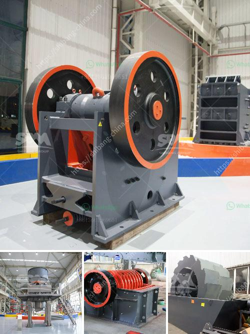

<h3>crushing equipment granite quarry nigeria</h3>
Nigeria has rich mineral resources, such as coal, gas, bauxite, gold, iron ore, limestone and zinc and so on. It is also an important market of ZENITH. Every year, many investors from Nigeria consult our company for crushers and grinding mills. In order to have a better communication with the customers and to know the local market better, we set up branch in Lagos, Nigeria. Through our Lagos branch, we have established long-term cooperation with many Nigerian customers.

Granite is a very hard stone, and it is suitable for both interior and exterior works. The demand for granite in Nigeria at the moment far outstrips supply, and will likely continue to do so at an ever-increasing rate. In addition to its suitability for many uses, granite also has several additional advantages. Its use is environmentally responsible and sustainable as it is sourced from small quarry operations that require little or no blasting, while leaving low-level residual tailings, which are easily deposited onsite or recycled.

Crushing equipment is key in the mining industry, particularly in granite quarrying. With granite being one of the hardest materials in the world, it is essential to choose the right crushing equipment to ensure efficient and effective operation. Choosing the right equipment significantly enhances productivity and maximizes return on investment for the quarry.

Crusher is the main crushing equipment in stone quarrying operation. Cone crusher is generally applied as secondary or tertiary crushing machine in stone quarry plant. Cone crusher use for sale is with low price and the highest capacities.

Crushing machine is the key equipment in stone quarrying operation. Cone crusher is generally applied as secondary or tertiary crushing machine in stone quarry plant. SBM’s decades of experience in the design and manufacture of cone crusher has created large increase in production capacity and coupled with cost-effective operation and ease of maintenance. Cone crusher can process many types of materials in stone quarry, from limestone to taconite, from ballast production to manufactured sand. Cone crusher can be designed as small portable plant, or large mobile crushing machine according to production requirements. It provides unbeatable performance in secondary and tertiary crushing applications.

There are many small scales or temporary crushing project for quarrying, mining, construction or recycling applications. They don't want to put too much investment cost for crusher machine, because complete new crushing equipment is expensive and requires high investment cost. They prefer used stone crusher machine with low price. There is long life after sale service for these used crusher machine.

Due to the combination of higher speed and throw, which increases the machine’s power rating and throughput capability, cone crusher use for sale hasthe highest capacities for their size in the industry.Cone crusheralso enables you to produce a finer product with fewer crushing stages, lowering your capital costs and saving energy.These used machines can operate in 24 hours 7 day. You can earn the investment cost back in few months.It feels great to run a business with the representatives in Nigeria as they provide great sales and service support.
<h3>Contact us</h3><ul><li><strong>Whatsapp:&nbsp;<a href="https://wa.me/8613661969651">+8613661969651</a></strong></li><li><a href="https://swt.shibang-china.com/?git&amp;zhl&amp;crushing equipment granite quarry nigeria"><strong>Online Service(chat now)</strong></a></li></ul><h3>Related</h3><ul><li><a href='roller mill price.md'>roller mill price</a></li><li><a href='gold shaker wash plant trommel for sale used new.md'>gold shaker wash plant trommel for sale used new</a></li><li><a href='stone crushing machine in zambia.md'>stone crushing machine in zambia</a></li><li><a href='used basalt stone crusher price in uae.md'>used basalt stone crusher price in uae</a></li><li><a href='crusher application.md'>crusher application</a></li></ul>