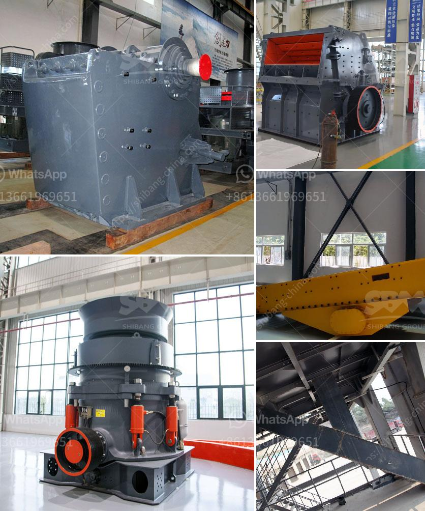

<h3>crushing equipment south africa crusher quotes</h3>
South Africa is a country known for its rich mineral resources and its mining industry plays a crucial role in driving its economic growth. To extract valuable minerals efficiently, the mining industry heavily relies on crushing equipment. This equipment is responsible for breaking down large rocks and minerals into smaller, more manageable pieces for further processing. In this article, we will delve into the world of crushing equipment in South Africa and explore some notable crusher quotes that highlight the significance of this machinery.

Crushing equipment is essential for the mining industry as it ensures the extraction of minerals in the most effective and efficient manner. Crushers are machines designed to reduce the size of materials, making them easier to handle and process. There are various types of crushers used in the mining industry, including jaw crushers, cone crushers, gyratory crushers, and impact crushers.

Jaw crushers are commonly used in mining operations due to their simplicity and ability to handle hard and abrasive materials. They consist of a fixed plate and a moving plate, with the material being crushed between them. Jaw crushers are often used as primary crushers, reducing the size of rocks before the secondary crushing stage.

Cone crushers, on the other hand, are suitable for secondary and tertiary crushing. They utilize a rotating cone mantle and an eccentrically-shaped bowl liner to crush rocks. Cone crushers are known for their high capacity and efficient crushing action, making them ideal for the mining industry.

Gyratory crushers are similar to cone crushers, but they have a different design. Instead of a rotating cone mantle, these crushers have a stationary main shaft with a rotating crusher head. Gyratory crushers are mainly used for primary crushing and have the advantage of producing a more uniform particle size compared to jaw and cone crushers.

Impact crushers, as the name suggests, use impact rather than pressure to crush the material. They are versatile machines capable of handling various materials, including soft and non-abrasive rocks. Impact crushers are often used in the mining industry for recycling purposes, as they can efficiently break down demolished concrete and asphalt.

Now let's turn our attention to some crusher quotes that shed light on the importance of crushing equipment in South Africa's mining industry.

1. "In the mining industry, crushing equipment is the backbone of efficient operations. They ensure that the extracted minerals are processed effectively and delivered to market." - Mining Company X

2. "Our jaw crushers have revolutionized the mining industry in South Africa. They are robust, reliable, and capable of handling the toughest materials, enhancing productivity in mining operations." - Crusher Manufacturer Y

3. "Cone crushers have played a significant role in improving the efficiency of our mining operations. The ability to produce uniform-sized particles has helped us achieve higher yields and reduce waste." - Mining Engineer Z

4. "Gyratory crushers are an essential part of our mining infrastructure. Their ability to handle large rocks and provide consistent crushing performance is unparalleled, making them an invaluable asset in the industry." - Mining Operator A

5. "Impact crushers have proven to be a game-changer in our mining operations. Their versatility and quick setup time have allowed us to crush and recycle materials on-site, reducing costs and minimizing environmental impact." - Mining Contractor B

In conclusion, crushing equipment plays a crucial role in the South African mining industry. Various types of crushers, such as jaw crushers, cone crushers, gyratory crushers, and impact crushers, are used to efficiently break down rocks and minerals for further processing. These machines, backed by their impressive performance and efficiency, help drive the mining industry's success in South Africa.
<h3>Contact us</h3><ul><li><strong>Whatsapp:&nbsp;<a href="https://wa.me/8613661969651">+8613661969651</a></strong></li><li><a href="https://swt.shibang-china.com/?git&amp;zhl&amp;crushing equipment south africa crusher quotes"><strong>Online Service(chat now)</strong></a></li></ul><h3>Related</h3><ul><li><a href='the process of belt conveyor.md'>the process of belt conveyor</a></li><li><a href='basalt production process.md'>basalt production process</a></li><li><a href='feasibility study of cement plant.md'>feasibility study of cement plant</a></li><li><a href='quartz ball mills hyderabad.md'>quartz ball mills hyderabad</a></li><li><a href='gyratory gyratory crusher manufacturer in india.md'>gyratory gyratory crusher manufacturer in india</a></li></ul>