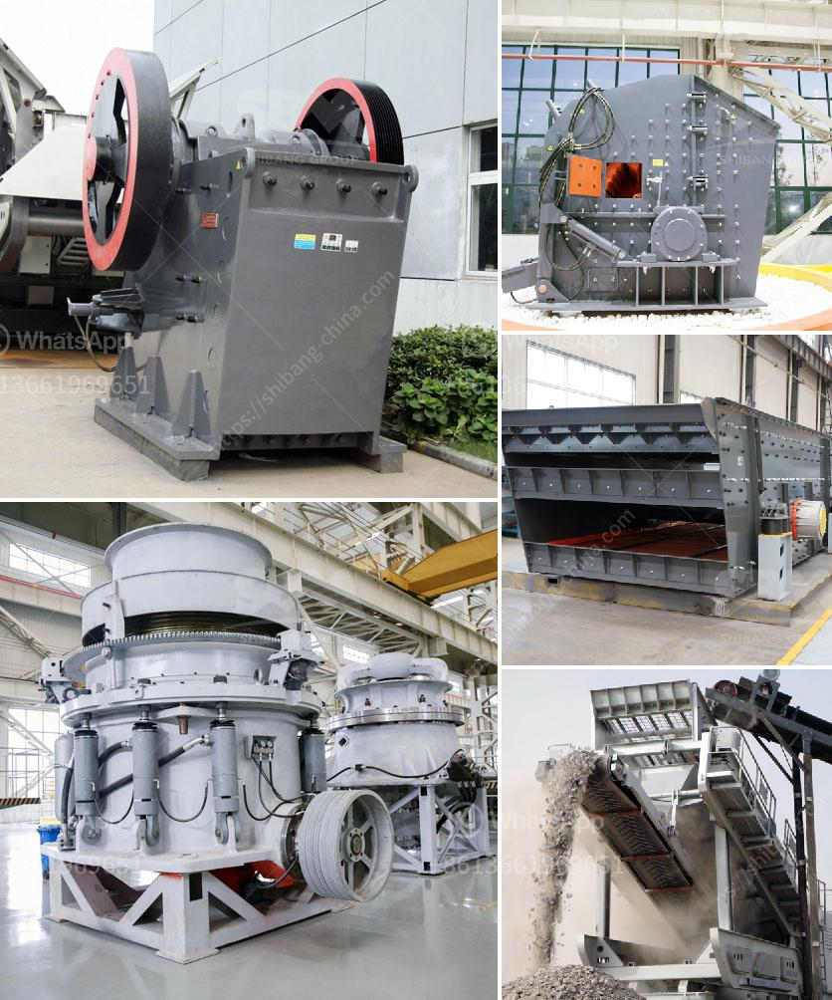

<h3>crushing machine manufacturer in pakistan</h3>
Pakistan is a growing country with an increasing population. With that comes the need for infrastructure development, particularly in the construction sector. Whether it is highways, railways, or residential and commercial buildings, there is a constant demand for crushed stones, gravel, and minerals used in these projects. This is where crushing machines play a crucial role.

A crushing machine is a heavy-duty equipment that's used to reduce the size of raw material like rock, ore, or mineral. It effortlessly breaks down large stones into smaller, more manageable pieces for construction purposes. In Pakistan, there are several crushing machine manufacturers that produce quality machinery for various industries.

One such company is Pakistan Crusher Machine Introduction-Crusher Machine. The company specializes in the production of crushing machines that are used in a variety of applications. For example, they offer jaw crushers, impact crushers, and cone crushers used for primary, secondary, and tertiary crushing in stone, mining, and construction industries.

Another reputable manufacturer in Pakistan is Chunyue Import & Export Trading Co., Ltd. This company produces a wide array of crushing machines that are used in mining, construction, and chemical industries. Their machines are known for their durability, efficiency, and excellent performance.

There are also numerous local manufacturers in Pakistan that cater to the needs of small-scale businesses and individuals. These manufacturers produce crushing machines that are affordable and suitable for smaller projects or personal use.

In conclusion, crushing machine manufacturers in Pakistan play a crucial role in the construction industry. They produce high-quality machines that help in the production of crushed stones and minerals used in various infrastructure projects. With the growing development needs in the country, these manufacturers are instrumental in meeting the demand for reliable and efficient crushing machines. Whether it is on a large scale or for personal use, there are manufacturers available that cater to all requirements.
<h3>Contact us</h3><ul><li><strong>Whatsapp:&nbsp;<a href="https://wa.me/8613661969651">+8613661969651</a></strong></li><li><a href="https://swt.shibang-china.com/?git&amp;zhl&amp;crushing machine manufacturer in pakistan"><strong>Online Service(chat now)</strong></a></li></ul><h3>Related</h3><ul><li><a href='used crusher machine germany.md'>used crusher machine germany</a></li><li><a href='portable impact crushers.md'>portable impact crushers</a></li><li><a href='stone crusher used machinery for sale in india.md'>stone crusher used machinery for sale in india</a></li><li><a href='quarry equipment suppliers miami.md'>quarry equipment suppliers miami</a></li><li><a href='suppliers of conveyor belts in south africa.md'>suppliers of conveyor belts in south africa</a></li></ul>