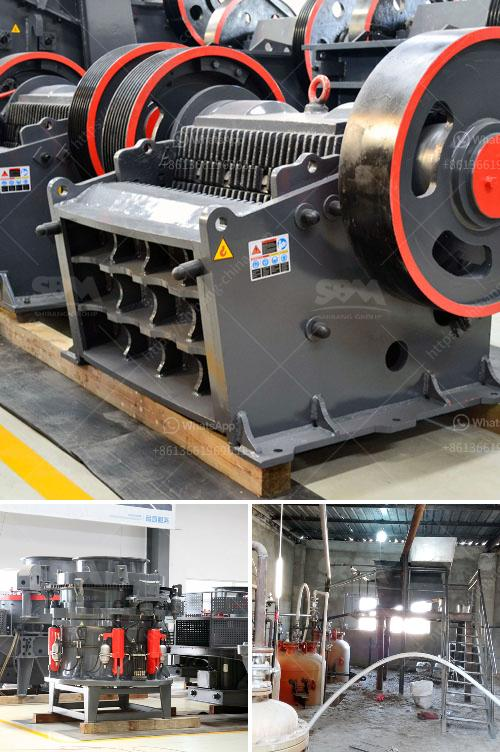

<h3>crushing machine manufacturers cape town</h3>
Cape Town, known for its remarkable skyline and urban development, is the epicenter of construction activities in South Africa. A crucial aspect of any construction project is crushing machinery, which efficiently breaks down large materials to manageable sizes. Luckily, Cape Town is fortunate to boast a number of world-class crushing machine manufacturers, delivering cutting-edge solutions to meet the growing demands of the industry.

These manufacturers utilize state-of-the-art technology to design and produce crushing machines that fulfill the diverse needs of construction companies. They offer a wide range of machines, including crushers, screening equipment, and grinders, designed to tackle various materials such as concrete, asphalt, and aggregates.

One of the key advantages of relying on local manufacturers in Cape Town is their understanding of the unique requirements and challenges faced by the construction industry in the region. They have a deep understanding of the local environmental conditions, which ensures that the machines are built to withstand the harsh weather and demanding work environments.

What sets these Cape Town manufacturers apart is their commitment to producing environmentally friendly solutions. As sustainability becomes a top priority for the construction industry, these manufacturers have been at the forefront of designing machines with reduced emissions and energy consumption. They prioritize eco-friendly practices in the manufacturing process, ensuring that their products have minimal impact on the environment.

Furthermore, these crushing machine manufacturers are dedicated to providing exceptional after-sales services. They offer comprehensive maintenance programs, training for operators, and readily available spare parts, ensuring uninterrupted operations and maximum productivity for their customers.

The contribution of crushing machine manufacturers in Cape Town cannot be underestimated. Their innovative solutions have revolutionized the construction industry by improving efficiency, reducing costs, and minimizing environmental impact. With their cutting-edge technology and commitment to customer satisfaction, these manufacturers continue to play a vital role in the development of Cape Town's urban landscape.
<h3>Contact us</h3><ul><li><strong>Whatsapp:&nbsp;<a href="https://wa.me/8613661969651">+8613661969651</a></strong></li><li><a href="https://swt.shibang-china.com/?git&amp;zhl&amp;crushing machine manufacturers cape town"><strong>Online Service(chat now)</strong></a></li></ul><h3>Related</h3><ul><li><a href='usa used equipment grinding mill minerals 3 tph 200 mesh.md'>usa used equipment grinding mill minerals 3 tph 200 mesh</a></li><li><a href='raymond mills for sale in pakistan.md'>raymond mills for sale in pakistan</a></li><li><a href='sample of joint operations agreement quarry mining.md'>sample of joint operations agreement quarry mining</a></li><li><a href='vsi crusher for crush sand.md'>vsi crusher for crush sand</a></li><li><a href='philippines stone crusher.md'>philippines stone crusher</a></li></ul>