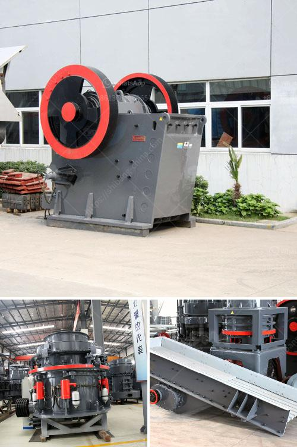

<h3>crushing plant in pakistan</h3>
A crushing plant is a machine designed to reduce large rocks into smaller rocks, gravel, or rock dust. Crushers may be used to reduce the size, or change the form, of waste materials so they can be more easily disposed of or recycled, or to reduce the size of a solid mix of raw materials (as in rock ore), so that pieces of different composition can be differentiated. Crushing is the process of transferring a force amplified by mechanical advantage through a material made of molecules that bond together more strongly, and resist deformation more, than those in the material being crushed do.

Crushing devices hold material between two parallel or tangent solid surfaces, and apply sufficient force to bring the surfaces together to generate enough energy within the material being crushed so that its molecules separate from (fracturing), or change alignment in relation to (deformation), each other. The earliest crushers were hand-held stones, where the weight of the stone provided a boost to muscle power, used against a stone anvil.

Quarry Crushing Plant in Pakistan Project, Stone Crusher In Quarry & Mining in Pakistan, Stone Crusher In Pakistan Gold Mining Process, Bauxite Grinding Process. Quarry and Mineral Mining Equipment for Mining in Pakistan. Construction Equipment Company - Crushing.

A Crushing plant is one-stop crushing installation, which can be used for rock crushing, garbage crushing, building materials crushing and other similar operations. Crushing plants may be either fixed or mobile. Crushing plants make use of a large range of equipment, such as a pre-screener, loading conveyor, intake hopper, magnetic separator, crushing unit, such as jaw crushers and cone crusher etc.

There are mainly four types of mobile crushing plants: tire mobile crushing plant, mobile jaw crushing plant, mobile impact crushing plant, and mobile cone crushing plant. Mobile mobile stone crushing plants are available in different sizes depending on the desired output and rate of production. Mobile crushing plants are popular in Pakistan due to their flexibility, easy transportation, reliable operation and high performance.

In Pakistan, there are many different scale stone crushing plants. Quartz stone crushing plant is widely used in commercial concrete production plants and more. The quarrying of granite has been a commercial undertaking since the early 1900's. Prior to the installation of the crushing plant, the following should be done. The road to the crushing plant is not yet developed, it can be a tricky and challenging task to construct a good road. This will also require the use of large quantities of crushed rock, which may not be readily available in the local market.

In conclusion, a crushing plant is a useful machine in mining industry. It is capable to crush and screen limestone, marble, granite, basalt, river stone and so on to produce sand & gravels with various granularities for construction and building industry.
<h3>Contact us</h3><ul><li><strong>Whatsapp:&nbsp;<a href="https://wa.me/8613661969651">+8613661969651</a></strong></li><li><a href="https://swt.shibang-china.com/?git&amp;zhl&amp;crushing plant in pakistan"><strong>Online Service(chat now)</strong></a></li></ul><h3>Related</h3><ul><li><a href='capacity 1 to 5 tons per hour price.md'>capacity 1 to 5 tons per hour price</a></li><li><a href='high pressure roller mill.md'>high pressure roller mill</a></li><li><a href='design of a barite grinding mill.md'>design of a barite grinding mill</a></li><li><a href='model project of soap stone powder.md'>model project of soap stone powder</a></li><li><a href='modeling clay process plant.md'>modeling clay process plant</a></li></ul>