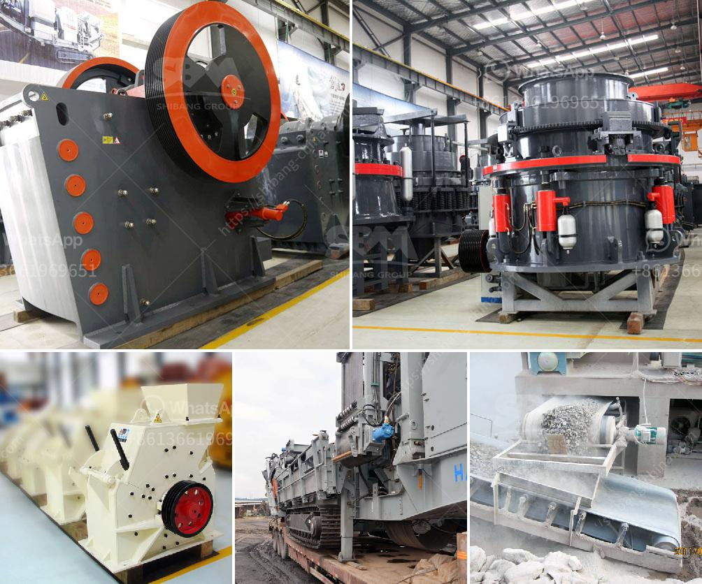

<h3>crushing plant thailand</h3>
Thailand is a country known for its beautiful beaches, rich cultural heritage, and delicious cuisine. However, behind its tourist attractions lies a thriving economy driven by various industries, including the construction sector. As the demand for construction materials continues to grow, so does the need for reliable and efficient crushing plants.

A crushing plant is a facility designed to break down large rocks into smaller pieces, gravel, or rock dust. It plays an essential role in the construction industry by turning aggregates into building materials. These materials form the foundation of infrastructure projects, such as roads, bridges, and buildings.

In recent years, Thailand has witnessed rapid urbanization and infrastructure development. This has created a surge in demand for construction materials, making crushing plants crucial in meeting these requirements. The need for durable and cost-effective construction materials is driving the growth of the crushing plant market in Thailand.

Several factors contribute to Thailand's favorable environment for crushing plant operations. Firstly, the country boasts an abundance of natural resources, such as limestone, granite, and basalt, which are widely used in the construction industry. This ensures a steady supply of raw materials for crushing plants.

In addition, Thailand has a well-developed transportation network, facilitating the transport of materials from quarries to crushing plants and construction sites. The efficient logistics infrastructure reduces time and cost, making it easier for crushing plant operators to meet customer demands.

Furthermore, the Thai government has been actively promoting investment in infrastructure development, which further boosts the demand for aggregates and construction materials. This favorable environment provides ample opportunities for crushing plant operators to expand their business and contribute to the country's economic growth.

However, despite the favorable conditions, the crushing plant market in Thailand is highly competitive. Companies must invest in state-of-the-art machinery and technology to stay ahead. Additionally, they must focus on environmental sustainability by adopting eco-friendly practices and complying with regulations.

In conclusion, the crushing plant industry in Thailand is flourishing due to the country's rapid urbanization and infrastructure development. The demand for construction materials creates ample opportunities for crushing plant operators to thrive. By leveraging Thailand's abundant natural resources and efficient transportation network, companies can meet customer demands while contributing to the country's growth and development.
<h3>Contact us</h3><ul><li><strong>Whatsapp:&nbsp;<a href="https://wa.me/8613661969651">+8613661969651</a></strong></li><li><a href="https://swt.shibang-china.com/?git&amp;zhl&amp;crushing plant thailand"><strong>Online Service(chat now)</strong></a></li></ul><h3>Related</h3><ul><li><a href='stone crushing plant leaves in uganda.md'>stone crushing plant leaves in uganda</a></li><li><a href='ball mill for aluminum powder.md'>ball mill for aluminum powder</a></li><li><a href='rotary dryer sales indonesia.md'>rotary dryer sales indonesia</a></li><li><a href='raymond mills in india.md'>raymond mills in india</a></li><li><a href='used asphalt batch plant for sale in dubai.md'>used asphalt batch plant for sale in dubai</a></li></ul>