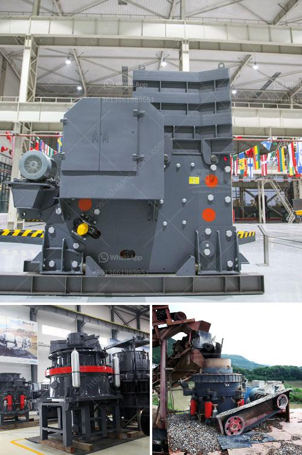

<h3>deisel hammer mill in south africa</h3>
Grinding materials is an essential operation in numerous industries, such as food processing, automotive, mining, power generation, and many more. The process usually involves breaking down larger-sized materials into smaller, more manageable sizes. One of the most popular and cost-effective methods used for this purpose is through the use of a diesel hammer mill.

In South Africa, where electricity is not always readily available, diesel-powered hammer mills are often used to grind materials to produce animal feed, charcoal, and other products. This versatile piece of equipment is highly efficient and delivers consistent results, making it a popular choice among farmers, entrepreneurs, and small business owners.

The diesel hammer mill operates by crushing material through a series of heavy hammers, free-swinging on a rotor. These hammers strike the material repeatedly, gradually reducing its size into a desired product. The size of the final product can be adjusted by adjusting the screen size on the bottom of the mill, enabling users to produce various particle sizes suitable for different applications or end-users.

One significant advantage of using a diesel hammer mill in South Africa is its portability. Unlike electricity-dependent hammer mills, diesel hammer mills can be easily transported and used in remote locations, where access to electricity might be limited. This makes it an ideal solution for farmers who need to grind feed on-site or entrepreneurs who operate in rural areas.

Another notable advantage of diesel hammer mills is their durability. These mills are designed to withstand heavy usage and harsh conditions, making them ideal for tough African climates. Their robust construction ensures that they can handle a wide range of materials, such as grains, wood chips, straw, grass, and even non-conventional materials like bones or shells.

In addition to their versatility and durability, diesel hammer mills are also known for being cost-effective. The absence of electricity-related costs significantly reduces operational expenses, making these mills a more affordable option for small-scale businesses. Furthermore, diesel fuel is generally cheaper and more accessible in remote areas compared to electricity, making diesel-powered mills a practical choice.

While diesel hammer mills offer numerous advantages, they do have certain limitations. The main limitation is the noise generated during operation. As diesel engines can be quite loud, the noise from the hammer mill may be a concern to those living or working nearby. However, the noise can be minimized by employing noise control measures or situating the mill in a strategic location away from populated areas.

To conclude, diesel hammer mills are a cost-effective, efficient, and portable solution for grinding materials in South Africa. Their versatility, durability, and affordability make them an excellent choice for farmers, entrepreneurs, and small business owners. Despite their noise during operation, diesel hammer mills remain a popular option due to their ability to work without electricity and their ability to handle various types of materials. As the demand for grinding technology continues to grow in South Africa, diesel hammer mills are expected to play a crucial role in meeting this demand and ensuring the continued success of numerous industries.
<h3>Contact us</h3><ul><li><strong>Whatsapp:&nbsp;<a href="https://wa.me/8613661969651">+8613661969651</a></strong></li><li><a href="https://swt.shibang-china.com/?git&amp;zhl&amp;deisel hammer mill in south africa"><strong>Online Service(chat now)</strong></a></li></ul><h3>Related</h3><ul><li><a href='crusher sri lanka.md'>crusher sri lanka</a></li><li><a href='small superfine grinder price malaysia.md'>small superfine grinder price malaysia</a></li><li><a href='process of manufacturing clay products.md'>process of manufacturing clay products</a></li><li><a href='price of mobile stone crusher 100 200 tph.md'>price of mobile stone crusher 100 200 tph</a></li><li><a href='difference between chain and belt conveyors.md'>difference between chain and belt conveyors</a></li></ul>