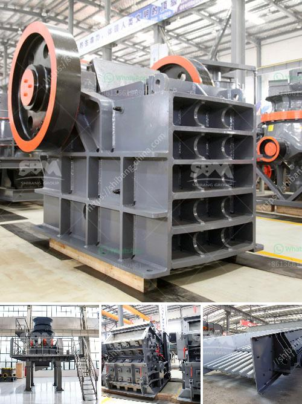

<h3>density of conveyor belts for mining</h3>
In the mining industry, conveyor belts are essential for transporting minerals, ores, and other raw materials from one location to another. These belts play a crucial role in ensuring the efficiency and productivity of mining operations. One crucial factor that mining companies must consider when selecting conveyor belts is their density.

Density refers to the mass per unit volume of a material. It is an important characteristic that impacts various aspects of conveyor belt performance, particularly in mining operations. Proper density ensures the optimal functioning of the conveyor belt, promoting safety, reliability, and cost-effectiveness.

One of the primary considerations for conveyor belt density is load capacity. Mining operations often involve heavy loads of material being transported over long distances. The conveyor belt must have a sufficient density to support the weight of these loads without sagging or breaking. A high-density belt ensures structural integrity and prevents downtime due to belt failure.

Additionally, the density of conveyor belts affects power consumption. Higher-density belts generally require higher power inputs to operate efficiently. Mining companies need to strike a balance between belt density and energy consumption to optimize overall operational costs. Manufacturers design conveyor belts with different density options to cater to different mining applications, allowing companies to select the most suitable belt for their specific needs.

Another critical aspect affected by belt density is belt life expectancy. The density of conveyor belts directly influences their durability and resistance to wear and tear. In demanding mining environments, belts can be exposed to harsh conditions such as abrasive materials, extreme temperatures, and heavy impacts. Choosing a belt with the appropriate density ensures longevity and reduces the frequency of maintenance and replacement.

Moreover, the density of conveyor belts has an impact on their flexibility. A balanced density allows the belt to conform to the shape of the conveyor system, enabling smooth movement around bends, inclines, and declines. Maintaining flexibility is crucial to prevent material spillage, slippage, or jamming, which can cause accidents and costly delays in mining operations. 

When considering the density of conveyor belts for mining, it is also essential to ensure compliance with safety regulations. Conveyor belts with inadequate density can pose serious risks to workers in the vicinity. Material spillage, belt slippage, or sudden failure can lead to injuries or fatalities. By selecting belts with appropriate density, mining companies can minimize such hazards and create a safer working environment.

In conclusion, the density of conveyor belts is a crucial factor in the mining industry. It impacts load capacity, power consumption, belt life expectancy, flexibility, and safety. Mining companies must carefully evaluate the density requirements based on the specific needs of their operations. Partnering with reputable manufacturers who offer a range of density options can assist in selecting the most suitable belt for optimal efficiency, cost-effectiveness, and safety in mining applications.
<h3>Contact us</h3><ul><li><strong>Whatsapp:&nbsp;<a href="https://wa.me/8613661969651">+8613661969651</a></strong></li><li><a href="https://swt.shibang-china.com/?git&amp;zhl&amp;density of conveyor belts for mining"><strong>Online Service(chat now)</strong></a></li></ul><h3>Related</h3><ul><li><a href='200tph cone crusher.md'>200tph cone crusher</a></li><li><a href='sand manufacturing machine price in tamilnadu.md'>sand manufacturing machine price in tamilnadu</a></li><li><a href='vibrating sieve supplier in south africa.md'>vibrating sieve supplier in south africa</a></li><li><a href='ball milling method in tamil.md'>ball milling method in tamil</a></li><li><a href='coal crusher types.md'>coal crusher types</a></li></ul>