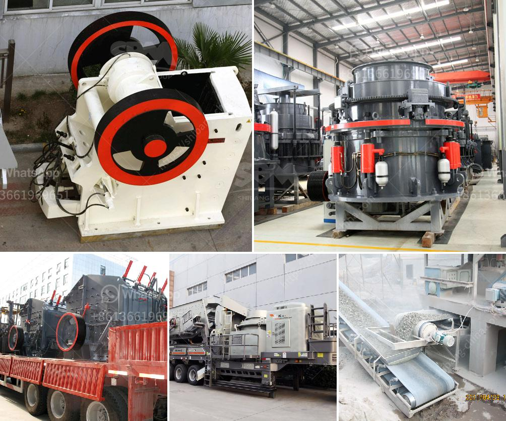

<h3>density of fine aggregate granite</h3>
The density of fine aggregate granite is an important factor to consider in construction projects. Fine aggregate granite is a type of crushed stone that is commonly used for the production of concrete and mortar. Its density determines its suitability for various applications within the construction industry.

Density is defined as the mass per unit volume of a substance. In the case of fine aggregate granite, it is typically measured in kilograms per cubic meter (kg/m³). The density of fine aggregate granite can vary depending on factors such as the source of the granite, the size and shape of the particles, and the presence of any impurities.

A typical range for the density of fine aggregate granite is between 2,600 and 2,700 kg/m³. However, it is important to note that this range is not fixed and can vary depending on the aforementioned factors. The density of fine aggregate granite is generally higher than that of most other aggregates used in construction, such as sand and gravel.

The high density of fine aggregate granite makes it a suitable material for various applications. One primary application is in the production of concrete. When mixed with cement, water, and coarse aggregates, fine aggregate granite helps to form a strong, durable, and cohesive concrete mixture. The high density of the granite particles enhances the strength and stability of the concrete, making it suitable for structural elements such as beams, columns, and slabs.

Another important application of fine aggregate granite is in the production of mortar. Mortar is a mixture of cement, fine aggregate, and water that is used to bind building blocks or bricks together. The density of the fine aggregate granite contributes to the overall strength and stability of the mortar, ensuring the long-lasting performance of the masonry work.

In addition to its density, fine aggregate granite also possesses other desirable qualities for construction purposes. It is typically angular in shape, which improves its interlocking properties when used in concrete or mortar mixtures. The angular particles create a better bond and increase the overall strength of the material.

Furthermore, the hardness and durability of fine aggregate granite make it resistant to degradation over time. It can withstand exposure to weather conditions, heavy traffic, and other forms of wear and tear, ensuring the longevity of the construction project.

In conclusion, the density of fine aggregate granite is a critical characteristic that determines its suitability for various construction applications. The high density, along with other qualities such as angular shape, hardness, and durability, make it an ideal material for producing strong and long-lasting concrete and mortar. It is essential for builders, engineers, and architects to carefully consider the density of fine aggregate granite to ensure the structural integrity and performance of their construction projects.
<h3>Contact us</h3><ul><li><strong>Whatsapp:&nbsp;<a href="https://wa.me/8613661969651">+8613661969651</a></strong></li><li><a href="https://swt.shibang-china.com/?git&amp;zhl&amp;density of fine aggregate granite"><strong>Online Service(chat now)</strong></a></li></ul><h3>Related</h3><ul><li><a href='mobile crusher rates per hour.md'>mobile crusher rates per hour</a></li><li><a href='cone crushers for sale in philippines.md'>cone crushers for sale in philippines</a></li><li><a href='stone crusher 60 to 100 tonnes per hour.md'>stone crusher 60 to 100 tonnes per hour</a></li><li><a href='price pe 600 900 stone crusher.md'>price pe 600 900 stone crusher</a></li><li><a href='chrome mining process machines.md'>chrome mining process machines</a></li></ul>