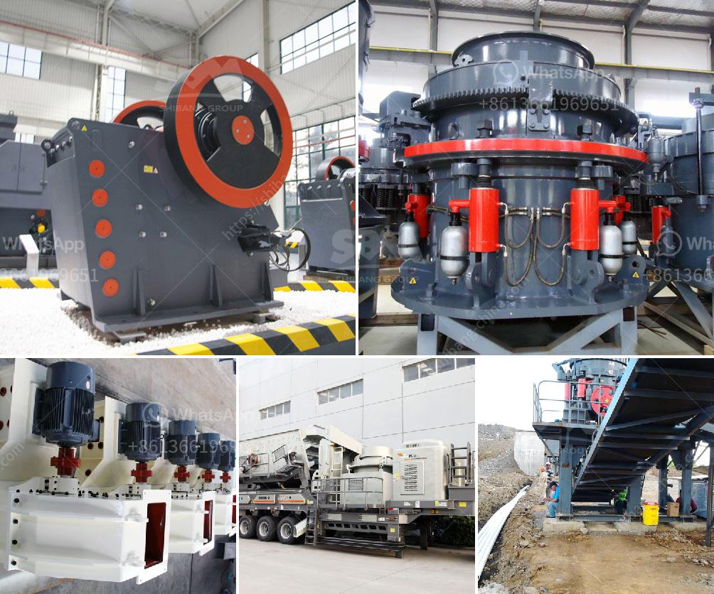

<h3>denver ball mills</h3>
Denver ball mills are grinding machines that reduce the size of materials and blend them together to create a uniform mixture. Consisting of rotating cylinders filled with loose grinding media, Denver ball mills are widely used in various industrial sectors for grinding different materials.

One of the key advantages of Denver ball mills is their ability to grind materials of all hardness levels. Whether it is soft, brittle, or even extremely hard materials, these mills can effectively break them down into smaller particles. This versatility makes them valuable in diverse industries like mining, cement, and pharmaceuticals.

The design of Denver ball mills ensures efficient grinding operations. The cylinders, called a drum or drum compartment, are lined with wear-resistant materials to protect the body from the abrasive grinding media. The rotation of the cylinder causes the grinding media to cascade, creating a grinding action that evenly crushes the material. The resulting mixture is then discharged through openings in the drum.

Another notable advantage of Denver ball mills is their flexibility in terms of capacity. Depending on the specific industrial application, these mills can be designed to handle materials ranging from small laboratory-scale batches to large-scale production volumes. This adaptability makes them suitable for both research and development purposes as well as high-volume manufacturing.

Furthermore, Denver ball mills are known for their reliability and low maintenance requirements. With proper care and regular maintenance, these machines can operate smoothly for extended periods, minimizing downtime and ensuring continuous production.

In conclusion, Denver ball mills are versatile, efficient, and reliable machines used in various industries for grinding and blending materials. Their ability to handle materials of different hardness levels, flexible capacity options, and low maintenance requirements make them a valuable asset for industrial operations.
<h3>Contact us</h3><ul><li><strong>Whatsapp:&nbsp;<a href="https://wa.me/8613661969651">+8613661969651</a></strong></li><li><a href="https://swt.shibang-china.com/?git&amp;zhl&amp;denver ball mills"><strong>Online Service(chat now)</strong></a></li></ul><h3>Related</h3><ul><li><a href='rock stone crushing machine in usa.md'>rock stone crushing machine in usa</a></li><li><a href='the process of belt conveyor.md'>the process of belt conveyor</a></li><li><a href='crushing plant in pakistan.md'>crushing plant in pakistan</a></li><li><a href='price of a tph sand fluidized bed dryer.md'>price of a tph sand fluidized bed dryer</a></li><li><a href='grinding mills in pakistan.md'>grinding mills in pakistan</a></li></ul>