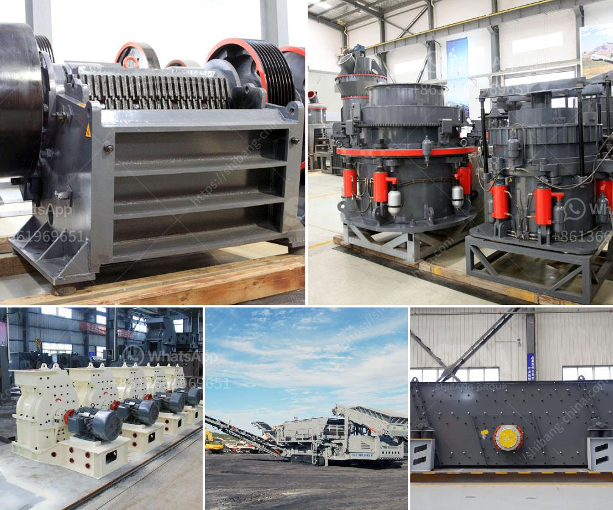

<h3>design and fabrication of ball mill pdf</h3>
A ball mill is a type of grinder used to grind and blend materials for use in mineral dressing processes, paints, pyrotechnics, ceramics, and selective laser sintering. It works on the principle of impact and attrition: size reduction is done by impact as the balls drop from near the top of the shell. A ball mill consists of a hollow cylindrical shell rotating about its axis. The axis of the shell may be either horizontal or at a small angle to the horizontal. It is partially filled with balls.

The grinding media are the balls, which may be made of steel, stainless steel, ceramic, or rubber. The inner surface of the cylindrical shell is usually lined with an abrasion-resistant material such as manganese steel or rubber. Less wear takes place in rubber lined mills. The length of the mill is approximately equal to its diameter.

The general idea behind the ball mill is an ancient one, but it was not until the industrial revolution and the invention of steam power that an effective ball milling machine could be built. It is reported to have been used for grinding flint for pottery in 1870.

The ball mill is used for grinding materials such as coal, pigments, and feldspar for pottery. Grinding can be carried out either wet or dry but the former is performed at low speed. Blending of explosives is an example of an application for rubber balls.

For systems with multiple components, ball milling has been shown to be effective in increasing solid-state chemical reactivity. Additionally, ball milling has been shown effective for production of amorphous materials.

In this article, we demonstrate how a laboratory ball mill can be used to conduct an experiment on grinding quickly and accurately, and the fabrication of a simple ball mill for performing such experiments. The design of the laboratory ball mill is based on the premise that grinding is a dispersing process using a grinding medium for dispersion. The ball mill uses a cylindrical container that rotates on a horizontal axis. This container is generally filled with the material to be ground, and a grinding medium, which refers to a substance used for grinding materials. It can be a solid or a fluid depending on the grinding process.

In conclusion, the design and fabrication of a ball mill can be achieved with a wide range of materials and methods. It is vital to consult experts in the field to ensure that the design and fabrication are done correctly and accurately. The use of a ball mill for grinding and mixing materials can be beneficial in many industries, such as the ceramics industry, where pigments need to be blended with binding agents or powders need to be milled to create uniform particles for subsequent processing.
<h3>Contact us</h3><ul><li><strong>Whatsapp:&nbsp;<a href="https://wa.me/8613661969651">+8613661969651</a></strong></li><li><a href="https://swt.shibang-china.com/?git&amp;zhl&amp;design and fabrication of ball mill pdf"><strong>Online Service(chat now)</strong></a></li></ul><h3>Related</h3><ul><li><a href='talc powder making.md'>talc powder making</a></li><li><a href='industrial application of pebble mill.md'>industrial application of pebble mill</a></li><li><a href='small jaw crusher supplier.md'>small jaw crusher supplier</a></li><li><a href='used stone crusher for sale in india.md'>used stone crusher for sale in india</a></li><li><a href='crusher machine bottlecrusher machine bottles.md'>crusher machine bottlecrusher machine bottles</a></li></ul>