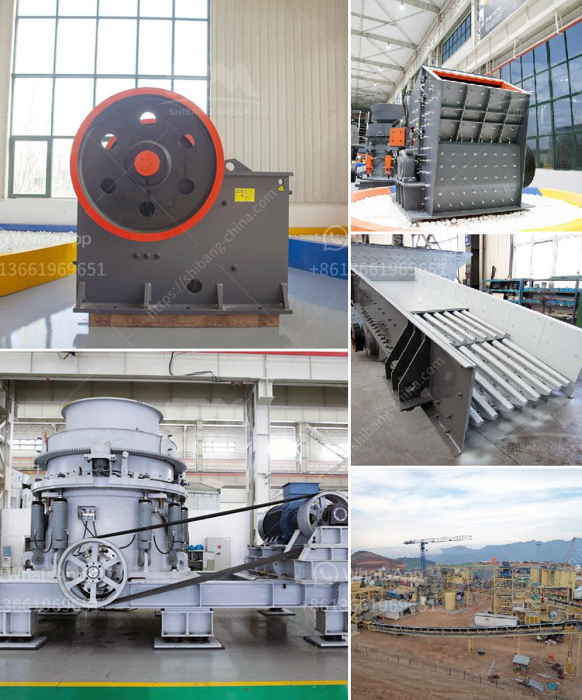

<h3>design drawing of hopper for crusher</h3>
A hopper is a container designed to receive and hold the bulk material for a crusher. It is usually made of steel or reinforced concrete and is an important component in the crushing process. Without a properly designed hopper, the efficiency and productivity of the crusher can be compromised.

The design drawing of a hopper for a crusher plays a significant role in ensuring the smooth and continuous flow of the material into the crusher chamber. The primary objective of the hopper design is to provide a regulated feed rate to the crusher, preventing any sudden surge of material and maintaining a consistent feed.

First and foremost, the design drawing should consider the size and volume of the hopper. It should be large enough to accommodate the material without any spillage or blockages, while also being compact enough to fit within the overall crusher structure. The dimensions of the hopper should be determined based on the type and size of the material to be crushed, as well as the required throughput of the crusher.

The shape of the hopper is equally important. It should be designed to promote the flow of material towards the crusher without causing any bridging or blockages. A funnel-shaped hopper is commonly used for this purpose, as it allows the material to flow freely downwards. The angle of the funnel should be carefully calculated to ensure a smooth flow, and any potential areas of material buildup should be identified in the design drawing and addressed accordingly.

The material of construction is also a crucial consideration in the hopper design. The hopper should be made of a material that is resistant to wear and abrasion caused by the impact of the falling material. Steel is often preferred for its durability and strength, but other materials such as reinforced concrete or polyethylene may also be suitable depending on the specific application and material characteristics.

Furthermore, the design drawing should incorporate features such as grizzly bars or screens to pre-screen the material before entering the crusher. This helps to remove any oversize or undesired material, improving the overall efficiency of the crushing process. The spacing and size of these grizzly bars or screens should be carefully determined based on the material properties and the desired product size.

In conclusion, the design drawing of a hopper for a crusher is a critical aspect of the overall crusher design. It should be carefully planned and executed to ensure a smooth and consistent flow of material into the crusher chamber. The size, shape, and material of construction should be considered, along with the inclusion of grizzly bars or screens to optimize the efficiency of the crushing process. By paying attention to these design details, a properly designed hopper can greatly enhance the performance and productivity of a crusher.
<h3>Contact us</h3><ul><li><strong>Whatsapp:&nbsp;<a href="https://wa.me/8613661969651">+8613661969651</a></strong></li><li><a href="https://swt.shibang-china.com/?git&amp;zhl&amp;design drawing of hopper for crusher"><strong>Online Service(chat now)</strong></a></li></ul><h3>Related</h3><ul><li><a href='portable crushing plants for sale.md'>portable crushing plants for sale</a></li><li><a href='quarry equipment in kenya.md'>quarry equipment in kenya</a></li><li><a href='potash ore crusher.md'>potash ore crusher</a></li><li><a href='aggregate washing machine.md'>aggregate washing machine</a></li><li><a href='iron ore processing equipment cost.md'>iron ore processing equipment cost</a></li></ul>