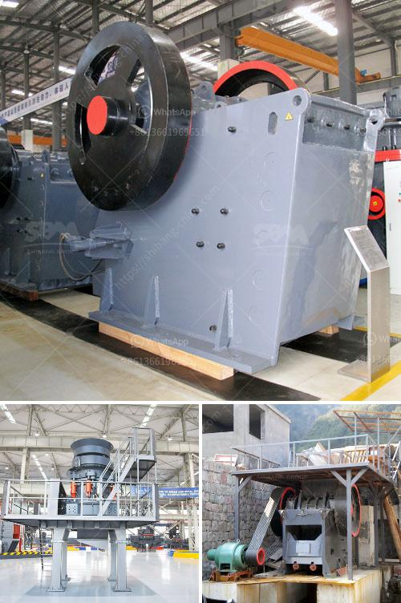

<h3>design of a barite grinding mill</h3>
The exploration of high-quality, abundant resources has led to the establishment of several industries around the world. One such industry that relies heavily on the availability of resources is the mining industry. Barite, an industrial mineral rich in demand, holds great potential as it is widely used in various industries such as oil and gas drilling, paints, and coatings. To cater to the increasing demand and ensure a sustainable supply, the design of a barite grinding mill becomes essential.

The barite grinding mill is the main equipment for processing barite ore, responsible for grinding the material into ultrafine powder. When working, the ultrafine powder is produced by the squeezing collision between the grinding roller and the grinding ring. The grinding roller and the grinding ring have a long replacement period, so it gets rid of the shortcoming that the wear parts of centrifugal mills have a short replacement period.

The analysis machine is used to control the particle size of the finished product, ensuring consistent and standardized products. The flour separator can separate the processed product by size, which further improves the efficiency and yield of the grinding mill. Additionally, the electromagnetic vibrating feeder evenly sends the raw materials into the host grinding chamber for grinding, avoiding the uneven feeding phenomenon and improving the grinding efficiency.

In terms of design, the barite grinding mill adopts a streamlined design, which combines grinding, impact, and other mechanical actions, helping to improve the grinding efficiency and overall performance. The equipment is equipped with a pulse dust collector, effectively reducing dust pollution and creating a cleaner and healthier production environment.

To enhance energy efficiency and reduce production costs, the barite grinding mill is designed with advanced technology, employing a power-saving, energy-efficient centrifugal fan. This not only reduces power consumption but also ensures stable and efficient production.

In conclusion, the design of a barite grinding mill plays a significant role in achieving maximum output and determining overall production efficiency. With the advancement of technology and the growing demand for barite, it becomes imperative to design efficient and sustainable grinding mills. The streamlined design, integrated with advanced technology, showcases the commitment of the industry towards energy efficiency, as well as meeting the demands of various industries that rely on barite as a key ingredient.
<h3>Contact us</h3><ul><li><strong>Whatsapp:&nbsp;<a href="https://wa.me/8613661969651">+8613661969651</a></strong></li><li><a href="https://swt.shibang-china.com/?git&amp;zhl&amp;design of a barite grinding mill"><strong>Online Service(chat now)</strong></a></li></ul><h3>Related</h3><ul><li><a href='crushing and screening of manganese ore.md'>crushing and screening of manganese ore</a></li><li><a href='talc powder making.md'>talc powder making</a></li><li><a href='hammer mill ghana.md'>hammer mill ghana</a></li><li><a href='concrete crusher in kenya for sale.md'>concrete crusher in kenya for sale</a></li><li><a href='stone crusher machine spintex accra.md'>stone crusher machine spintex accra</a></li></ul>