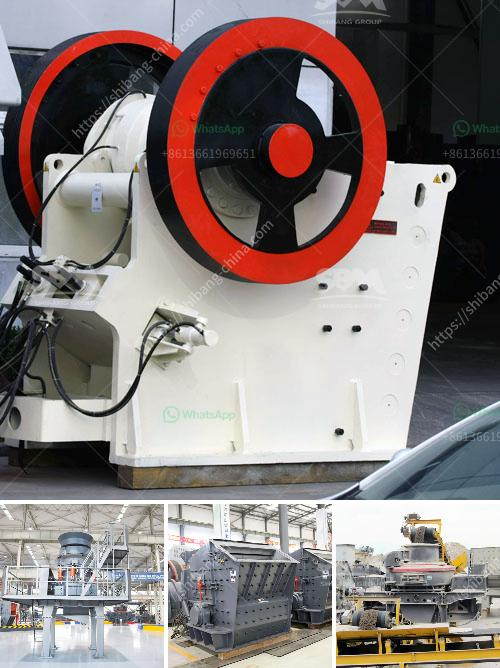

<h3>design of harmer mill</h3>
The design of a hammer mill is a vital component of the overall process in creating quality particles to be used in various applications. In the process, the hammer mill crushes materials into consistent particles that are used for various purposes such as grinding cereals, wood, biomass, and other materials. This machine is equipped with a series of rotating hammers, which strike and grind the material to produce the desired particle size.

One of the key design aspects of a hammer mill is the rotor, which acts as the main shaft. It is the backbone element of this machine and houses the hammers that crush the materials. The rotor is made up of heavy-duty steel and is designed to withstand high stress levels, ensuring durability and longevity.

The arrangement and configuration of the hammers are also crucial in the overall design of a hammer mill. They are strategically positioned on the rotor in order to maximize the impact force produced during the grinding process. The hammers can be arranged in a single row or multiple rows, depending on the desired particle size reduction and the characteristics of the material being processed.

Another important design feature of a hammer mill is the screen size, which determines the particle size and the grinding efficiency. The screen plays a vital role in controlling the particle size distribution and optimizing the grinding process. It acts as a barrier that allows only particles of a certain size to pass through, while larger particles are retained and sent back into the grinding chamber for further processing. Screens with different hole sizes can be easily installed and changed to cater to specific particle size requirements.

The feeding system is another crucial aspect of hammer mill design. It ensures a consistent and uniform feed rate to the grinding chamber, preventing blockages and optimizing the grinding efficiency. The system typically consists of a feed hopper, a conveyor or auger, and a control mechanism. The design of the feeding system is tailored to the specific requirements of the material being processed and can be manually or electronically controlled.

Furthermore, safety is an integral consideration in the design of a hammer mill. Safety features such as guards and interlocking mechanisms are incorporated to prevent accidents and ensure operator protection. Additionally, advanced technologies and monitoring systems can be integrated to detect and prevent potential issues such as overheating or blockages.

In summary, the design of a hammer mill plays a significant role in ensuring the overall performance and efficiency of the machine. It takes into account factors such as rotor design, hammer configuration, screen size, feeding system, and safety features. With careful consideration and customization, a hammer mill can effectively and efficiently crush a wide range of materials, providing high-quality particles for various applications.
<h3>Contact us</h3><ul><li><strong>Whatsapp:&nbsp;<a href="https://wa.me/8613661969651">+8613661969651</a></strong></li><li><a href="https://swt.shibang-china.com/?git&amp;zhl&amp;design of harmer mill"><strong>Online Service(chat now)</strong></a></li></ul><h3>Related</h3><ul><li><a href='sand making stone quarry.md'>sand making stone quarry</a></li><li><a href='types of conveyors belts.md'>types of conveyors belts</a></li><li><a href='paint grinding ball mill.md'>paint grinding ball mill</a></li><li><a href='cost of stone crusher in nigeria.md'>cost of stone crusher in nigeria</a></li><li><a href='ball crusher gold machine.md'>ball crusher gold machine</a></li></ul>