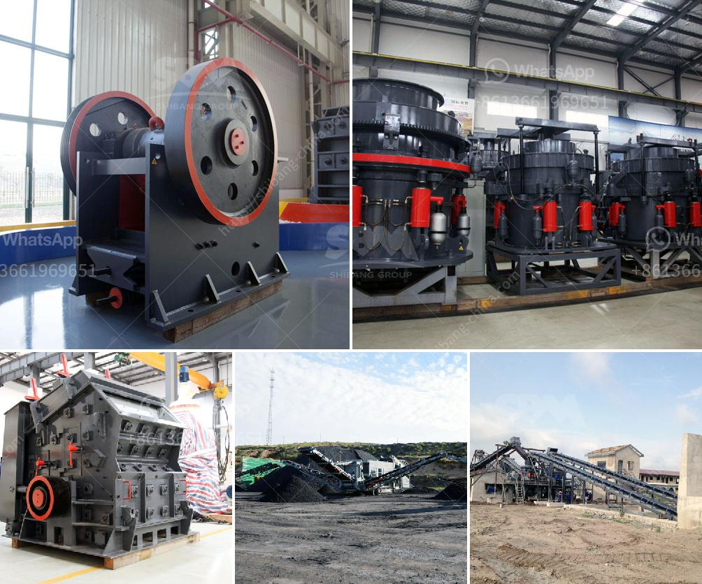

<h3>design of screening machines</h3>
The design of screening machines plays a crucial role in various industries, ranging from mining and construction to food processing and pharmaceuticals. These machines are designed to efficiently separate and classify particles based on their size and shape, ensuring the quality and consistency of the final product.

One of the key factors in designing screening machines is to consider the specific application and requirements of the industry. Different industries have diverse needs, such as the size of particles to be screened, the desired throughput, and the level of precision required. For instance, in the mining industry, where large quantities of materials need to be processed, robust and high-capacity machines are necessary. On the other hand, the pharmaceutical industry demands higher precision and cleanability to meet stringent regulatory standards.

The design of screening machines encompasses various components and features. The sieve or screen, which separates the particles, is a critical element. It needs to be carefully designed to withstand the force of material impact and yet allow desired particles to pass through. The selection of suitable materials, such as stainless steel or polyurethane, is essential for the longevity and performance of the screen.

The motion of the screening machine also needs to be considered. There are different types of motion, including gyratory, vibratory, and rotary, each with its advantages depending on the application. Vibratory screening machines, for instance, provide efficient particle separation through gentle vibrations, making them ideal for fragile materials.

In addition to the core components, other factors affecting the design of screening machines include ease of maintenance, installation, and energy efficiency. Machines should be designed with easy access to the interior for cleaning and maintenance purposes. Moreover, energy consumption should be optimized to reduce operating costs and environmental impact.

In conclusion, the design of screening machines is a complex process that requires a thorough understanding of the industry's specific needs. By carefully considering factors such as application requirements, choice of materials, motion, and ease of maintenance, manufacturers can create machines that efficiently and effectively meet the demands of various industries. These well-designed screening machines play a vital role in ensuring the quality and consistency of products, contributing to the growth and success of businesses in numerous sectors.
<h3>Contact us</h3><ul><li><strong>Whatsapp:&nbsp;<a href="https://wa.me/8613661969651">+8613661969651</a></strong></li><li><a href="https://swt.shibang-china.com/?git&amp;zhl&amp;design of screening machines"><strong>Online Service(chat now)</strong></a></li></ul><h3>Related</h3><ul><li><a href='cement process plant crushing machines manufacturer.md'>cement process plant crushing machines manufacturer</a></li><li><a href='the process of belt conveyor.md'>the process of belt conveyor</a></li><li><a href='raymond mills in india.md'>raymond mills in india</a></li><li><a href='gravel manufacturing company in thiruvallur district.md'>gravel manufacturing company in thiruvallur district</a></li><li><a href='clay beneficiation.md'>clay beneficiation</a></li></ul>