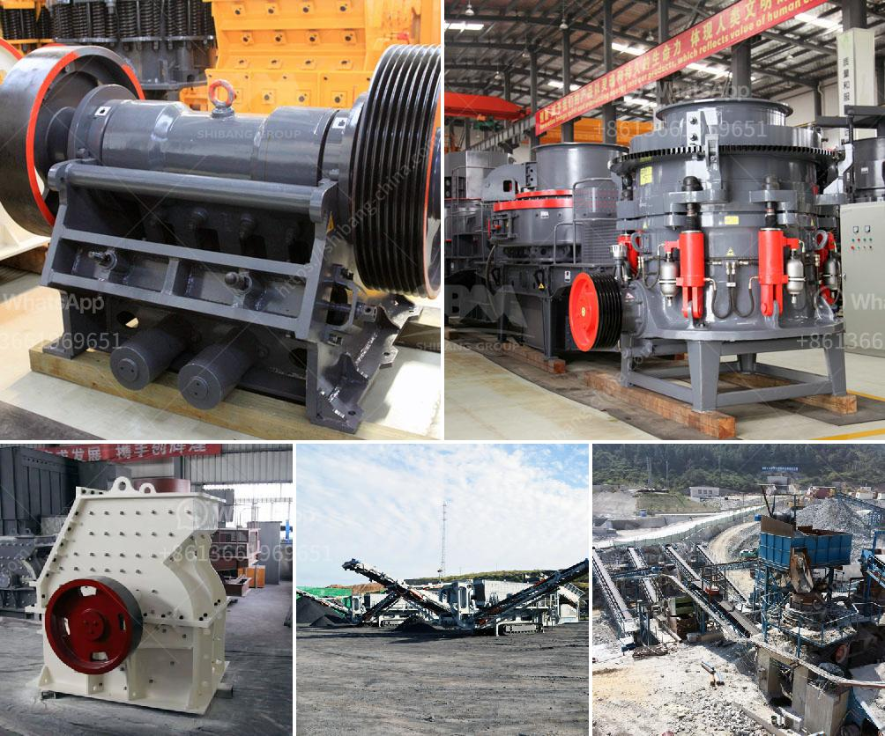

<h3>diagram of a hammer mill machine</h3>
A diagram of a hammer mill machine is a machine used to shred or crush materials into smaller pieces. The basic design of machines of this type involve a rotating shaft to which free-swinging hammers are attached. This assembly is enclosed by a drum which holds the material to be pulverized. A hopper positioned at the top of the machine allows materials to be loaded into the drum, where gravity and the rotating hammers break them down into smaller pieces.

The diagram of a hammer mill machine is quite straightforward. It consists of a few main parts: a drum-shaped chamber with a rotating shaft, on which hammers are mounted. The hammers rotate freely, allowing them to be swung outwards when the machine is in operation and back towards the chamber when not in use. This swinging motion allows the hammers to crush the material against the chamber walls, breaking it down into smaller pieces.

A diagram of a hammer mill machine is useful for understanding the overall structure of the machine and how it works. The diagram can be particularly helpful for new operators, who need to understand the process of its operation, and for anyone interested in the mechanics of the machine.

In conclusion, a diagram of a hammer mill machine is a valuable tool when trying to understand its operation and functionality. It provides a clear visual representation of the machine's structure and how it works. Whether you are a new operator or simply curious about the mechanics of such a machine, a diagram can be an invaluable resource.
<h3>Contact us</h3><ul><li><strong>Whatsapp:&nbsp;<a href="https://wa.me/8613661969651">+8613661969651</a></strong></li><li><a href="https://swt.shibang-china.com/?git&amp;zhl&amp;diagram of a hammer mill machine"><strong>Online Service(chat now)</strong></a></li></ul><h3>Related</h3><ul><li><a href='cost of the process of mining limestone.md'>cost of the process of mining limestone</a></li><li><a href='used ball mill for sale india.md'>used ball mill for sale india</a></li><li><a href='setting up limestone processing plant in nigeria.md'>setting up limestone processing plant in nigeria</a></li><li><a href='bentonite processing plant quotation.md'>bentonite processing plant quotation</a></li><li><a href='stone jaw crusher ppt for seminar.md'>stone jaw crusher ppt for seminar</a></li></ul>