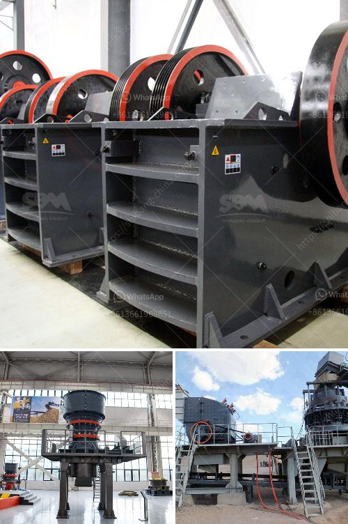

<h3>diagram of a hammer mill</h3>
A diagram of a hammer mill can be advantageous if you understand the parts inside. Typically, the purpose of a hammer mill is to shred or crush material into smaller pieces by the repeated blows of small hammers mounted on a vertical or horizontally rotating shaft. The material is passed through the chamber of the hammer mill and once the desired size is achieved, it exits through a sizing screen.

1. The feeding mechanism: Here, the material is either manually or automatically loaded into the hammer mill’s chamber through the hopper. The hopper depends on the size of the incoming material, and it guides the material towards the grinding chamber at a controlled rate.

2. The grinding chamber: This is where the action takes place! It is the heart of the hammer mill and consists of a rotating shaft with free-swinging hammers mounted on it. As the shaft spins, the hammers deliver repeated blows to the material, thus reducing its size.

3. Sizing screen: This part of the hammer mill determines the final size of the particles. It consists of a perforated screen that regulates the output particle size by controlling the passage of shredded material. Different sized screens can be used for different applications to achieve the desired particle size range.

4. Discharge mechanism: Once the material reaches the desired particle size, it exits the grinding chamber and passes through the sizing screen. It then leaves the hammer mill through the discharge chute, ready to be processed further or collected for use.

In conclusion, understanding the diagram of a hammer mill can help you gain insights into its functioning. It is an essential tool in various industries, including manufacturing, agriculture, and food processing, where size reduction of materials is required. By breaking down raw materials into smaller pieces, a hammer mill offers increased efficiency and versatility in processing operations.
<h3>Contact us</h3><ul><li><strong>Whatsapp:&nbsp;<a href="https://wa.me/8613661969651">+8613661969651</a></strong></li><li><a href="https://swt.shibang-china.com/?git&amp;zhl&amp;diagram of a hammer mill"><strong>Online Service(chat now)</strong></a></li></ul><h3>Related</h3><ul><li><a href='caterpillar stone crusher.md'>caterpillar stone crusher</a></li><li><a href='price hammer mill capacity of made in china.md'>price hammer mill capacity of made in china</a></li><li><a href='sand screening machine.md'>sand screening machine</a></li><li><a href='quarrying crusher in zimbia.md'>quarrying crusher in zimbia</a></li><li><a href='price of mobile stone crusher 100 200 tph.md'>price of mobile stone crusher 100 200 tph</a></li></ul>