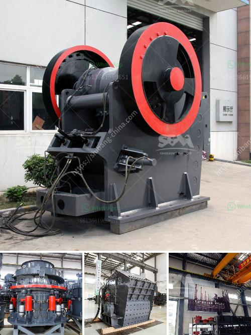

<h3>difeerence between jow crusher and hammer mill</h3>
The difference between a jaw crusher and a hammer mill is based on the size of the particles being processed. A jaw crusher uses compressive force to break down materials, whereas a hammer mill uses low-speed impact to reduce particles through collision. 

To determine the best suited machine for your material, you will need to consider multiple factors. First, the material type and size need to be taken into account. Jaw crushers are ideal for processing materials such as granite, basalt, gravel, limestone, and concrete. On the other hand, hammer mills are best suited for soft to medium-hard materials such as ores and grains. 

In terms of operating principle, a jaw crusher is a device that uses two steel plates to crush rock. The larger rock is inserted between the two steel plates and is subjected to strong pressure. The pressure breaks the rock apart and passes it through the crusher. If the jaw crusher is not able to handle the rock, then the rock is sent to a secondary crusher, usually a cone crusher, to break it down even further. 

In contrast, a hammer mill breaks materials by smashing them with rotating hammers. These hammers are either fixed or swinging, depending on the speed and power of the machine. Due to the repeated impacts, the material is broken into smaller pieces. Hammer mills are used in a wide range of applications, including crushing crops such as grains and beans, recycling concrete, and shredding yard waste. 

One key difference between a jaw crusher and a hammer mill is that the former operates at a higher frequency, which results in higher impact force. However, this difference in impact force does not affect the performance of the hammer mill because the material breaks into smaller pieces before it reaches the hammers. 

Another difference between the two machines is their output capacity. A jaw crusher can process larger rocks and produce more coarse crushed particles, while a hammer mill is typically used for smaller rocks and fine particles. 

The maintenance and operating costs of both machines also differ. A jaw crusher requires regular maintenance to ensure the proper functioning of the machine and to prevent any potential breakdowns. On the other hand, a hammer mill requires minimal maintenance and has a lower operating cost. 

In conclusion, the choice between a jaw crusher and a hammer mill ultimately depends on your material and processing needs. If you have a larger quantity of materials that need to be processed, a jaw crusher would be the more suitable option. However, if you are looking to create finer particles and reduce your operating costs, a hammer mill may be the better choice. It is always recommended to consult with a professional to determine the best machine for your specific application.
<h3>Contact us</h3><ul><li><strong>Whatsapp:&nbsp;<a href="https://wa.me/8613661969651">+8613661969651</a></strong></li><li><a href="https://swt.shibang-china.com/?git&amp;zhl&amp;difeerence between jow crusher and hammer mill"><strong>Online Service(chat now)</strong></a></li></ul><h3>Related</h3><ul><li><a href='ballast crusher for sale in kenya.md'>ballast crusher for sale in kenya</a></li><li><a href='quartz grinding ball mill working.md'>quartz grinding ball mill working</a></li><li><a href='types of ball mill machine for gold.md'>types of ball mill machine for gold</a></li><li><a href='cement clinker price cement clinker price.md'>cement clinker price cement clinker price</a></li><li><a href='processing of bauxite crusher.md'>processing of bauxite crusher</a></li></ul>