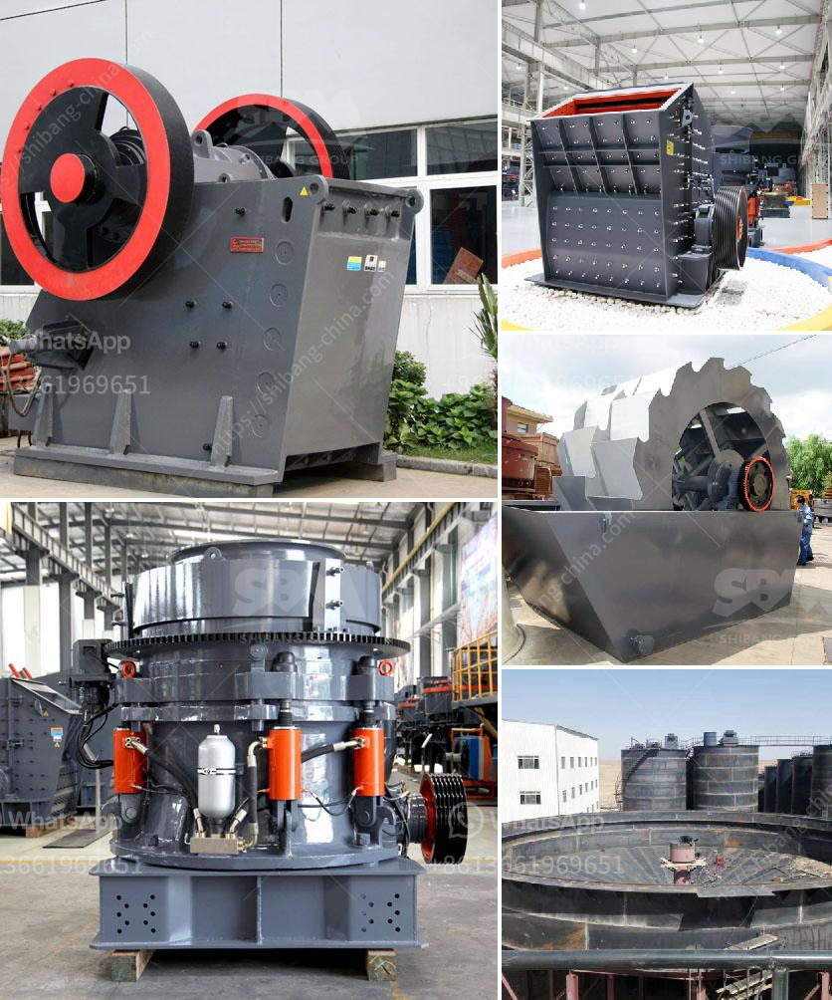

<h3>difference between a hammer crusher and a hammer mill</h3>
The difference between a hammer crusher and a hammer mill is that the crushing cavity of a hammer crusher is narrow, while the crushing cavity of a hammer mill is wide. Hammer crusher is mainly used for crushing various ores and medium hardness materials with weak abrasiveness. The compressive strength of the material does not exceed 100MPa and the moisture content is less than 15%. The broken materials are coal, salt, chalk, gypsum, brick, limestone, etc.

The hammer crusher is composed of a box body, a rotor, a hammer head, a counter lining plate, a sieve plate, and other components. The rotor is driven by the motor to move in the crushing chamber. The material is impacted by the hammer head and crushed. The broken material is discharged from the lower end of the machine. The crusher is generally equipped with a screening device to prevent the crushed materials from returning to the crusher cavity and affecting the normal operation of the crusher.

A hammer mill, on the other hand, is a machine used to shred or crush materials into smaller pieces. The basic design of the machine involves a rotating shaft that revolves around the horizontal axis. The shaft is fitted with several hammers that crush the materials as they enter the machine. The material is fed into the hopper, which contains a sieve plate that determines the size of the materials. The smaller particles pass through the sieve plate and are discharged, while the larger particles continue to be crushed.

One of the main differences between a hammer crusher and a hammer mill is that the hammer crusher can achieve a wide range of particle sizes. More importantly, the discharging size of the hammer crusher can be adjusted according to the production requirements. Even though the hammer mill has a broader application range than the hammer crusher, the material processed by the hammer crusher has a finer particle size. It is generally used as a secondary crushing equipment.

Moreover, the hammer crusher can not only be used in the crushing lines of sand and gravel plants but also in ore dressing lines and other industrial sectors. It is suitable for crushing medium-hard and brittle materials such as limestone, coal, salt, white sub, gypsum, alum, brick, tile, coal gangue, and so on.

In contrast, the hammer mill is mainly used for the shredding or crushing of materials with a medium-to-high hardness and uniform particle size. It is commonly used in various industries, such as mining, smelting, building materials, highways, railways, water conservancy, and chemical industries. The hammer mill can crush materials with both dry and wet conditions. Its advantages include easy operation, simple structure, convenient maintenance, and low investment cost.

In summary, the main differences between a hammer crusher and a hammer mill are the crushing cavity, the production capacity, and the particle size. A hammer crusher is used to crush materials with a lower abrasiveness, while a hammer mill is used to crush materials with a higher hardness and uniform particle size. Both machines have their own advantages and disadvantages, and it is important to choose the appropriate machine for the specific production requirements.
<h3>Contact us</h3><ul><li><strong>Whatsapp:&nbsp;<a href="https://wa.me/8613661969651">+8613661969651</a></strong></li><li><a href="https://swt.shibang-china.com/?git&amp;zhl&amp;difference between a hammer crusher and a hammer mill"><strong>Online Service(chat now)</strong></a></li></ul><h3>Related</h3><ul><li><a href='china rock crusher.md'>china rock crusher</a></li><li><a href='stone crusher manufacturer dhaka.md'>stone crusher manufacturer dhaka</a></li><li><a href='gypsum crusher price in ethiopia.md'>gypsum crusher price in ethiopia</a></li><li><a href='south africa mobile crusher.md'>south africa mobile crusher</a></li><li><a href='type of conveyors belt pdf.md'>type of conveyors belt pdf</a></li></ul>