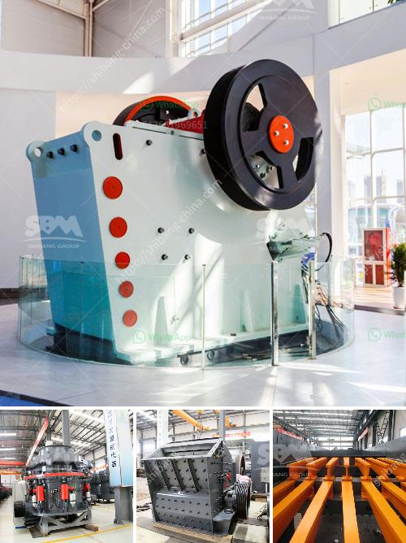

<h3>difference between chain and belt conveyors</h3>
Chain and belt conveyors are commonly used in industrial settings to transport heavy materials efficiently. However, there are some key differences between these two types of conveyors, which make them suitable for different applications. Understanding these differences is crucial for selecting the right conveyor system for your specific needs.

The first major difference between chain and belt conveyors is the way they operate. Chain conveyors utilize a series of interlocking chains or links to move products or materials along a conveyor belt. These chains can be powered by an electric motor or driven manually. On the other hand, belt conveyors use a belt made of durable materials, such as rubber, to transport items smoothly along a flat or inclined surface. The belt is powered by an electric motor, resulting in a continuous and efficient movement of goods.

One of the main advantages of chain conveyors is their ability to handle heavy loads. The interlocking chains can withstand high levels of stress and are less likely to break or become damaged when transporting large and bulky items. In contrast, belt conveyors are better suited for lighter loads as the belt may experience wear and tear when dealing with heavy materials. Additionally, chain conveyors are commonly used in harsh environments where there is excessive dust, debris, or high temperatures, thanks to their rugged construction and durability.

Another critical difference between chain and belt conveyors lies in their maintenance and operational requirements. Chain conveyors generally require more maintenance due to the complexity of their design. The chains need to be periodically inspected and lubricated to ensure smooth operation. Any corrosion or damage to the chains must be addressed promptly to prevent further problems. In contrast, belt conveyors are relatively easy to maintain as long as the belt is kept clean and free from debris. However, the belt may need to be periodically replaced if it becomes damaged over time.

Besides, chain and belt conveyors differ in terms of their cost and flexibility. Generally, chain conveyors tend to be more expensive to install and maintain due to their robust construction and frequent need for lubrication. However, they are incredibly useful for carrying heavy and uneven loads, making them highly versatile in many industries. On the other hand, belt conveyors are less costly to install and maintain, making them a popular choice for industries with lighter loads and more straightforward transportation needs. Belt conveyors are also highly flexible, as they can be designed to accommodate curves, inclines, and declines in the conveyor system.

In conclusion, chain and belt conveyors are both valuable tools for transporting goods in industrial settings, but their differences make them better suited for specific applications. Chain conveyors excel at handling heavier loads and operating in harsh environments, but they require more maintenance and can be costlier. Belt conveyors, on the other hand, are ideal for lighter loads and offer greater flexibility in terms of design. Understanding these differences can help you make an informed decision when selecting a conveyor system that best fits your needs.
<h3>Contact us</h3><ul><li><strong>Whatsapp:&nbsp;<a href="https://wa.me/8613661969651">+8613661969651</a></strong></li><li><a href="https://swt.shibang-china.com/?git&amp;zhl&amp;difference between chain and belt conveyors"><strong>Online Service(chat now)</strong></a></li></ul><h3>Related</h3><ul><li><a href='grinder mill in bolivia.md'>grinder mill in bolivia</a></li><li><a href='quartz grinding machine cost.md'>quartz grinding machine cost</a></li><li><a href='cost of stone crusher in nigeria.md'>cost of stone crusher in nigeria</a></li><li><a href='second hand cement mill in india.md'>second hand cement mill in india</a></li><li><a href='equipment jaw crusher for sale philippine.md'>equipment jaw crusher for sale philippine</a></li></ul>