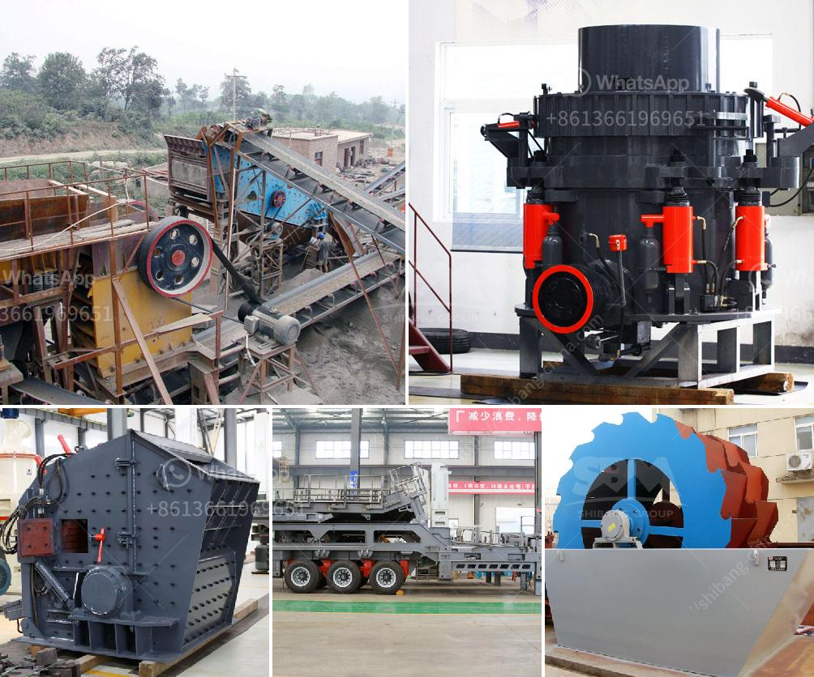

<h3>difference between jaw crusher and cone crusher</h3>
Jaw Crusher and Cone Crusher are two popular stone crushing machines used in mining, quarrying, and construction industries. Both of them have their own advantages and disadvantages, and their own applications.

The jaw crusher has a vast range of applications. It is used for crushing rocks or ores into smaller pieces for further processing in a ball mill or hammer crusher. The jaw crusher is not suitable for hard materials and high abrasion materials, such as quartz stone and basalt. It is also not the best choice for materials with high moisture content, as it tends to clog and stick to the jaw plates.

On the other hand, the cone crusher is often used in secondary and tertiary crushing stages. It can be used for both veining and hard rock materials, such as granite, basalt, iron ore, limestone, quartzite, sandstone, and pebble. Its crushing principle is based on squeezing the materials between a fixed cone and a movable cone. The cone crusher has a large crushing ratio, high efficiency, low energy consumption, and uniform product size. It is suitable for crushing medium and fine materials.

1. Jaw Crusher has a movable jaw plate and a fixed jaw plate. The discharge size is adjustable and the crushing process is mainly carried out by the squeezing of the two jaw plates. Compared with the cone crusher, the jaw crusher is suitable for crushing large materials, but the output is not as high as the cone crusher.

2. Cone crusher is mainly used in the secondary or tertiary crushing process. Cone crusher can crush various medium-hard ores and rocks with the platts hardness below 16. The crushing chamber is determined by the use of ore. Standard type is suitable for medium crushing, medium type is suitable for fine crushing, and short head type is suitable for fine crushing.

3. The cone crusher is more expensive than the jaw crusher, but its processing capacity is greater and the wearing parts are less worn. When choosing a cone crusher, it is necessary to select a suitable model according to the specific requirements of the plant.

4. Cone crushers can be divided into four categories according to their structure and function: spring cone crusher, hydraulic cone crusher, composite cone crusher, and cone crusher with spring and hydraulic cylinder. Different types of crushers have different use scenarios.

In conclusion, the jaw crusher and the cone crusher are the primary crushing equipment. Different models of the jaw crusher have different capacity. Therefore, the jaw crusher is initially broken, and after crushing, the size of the material will be suitable for processing by the cone crusher. The cone crusher and jaw crusher are classified into different categories, and different models are selected according to the specific requirements of different crushing tasks.
<h3>Contact us</h3><ul><li><strong>Whatsapp:&nbsp;<a href="https://wa.me/8613661969651">+8613661969651</a></strong></li><li><a href="https://swt.shibang-china.com/?git&amp;zhl&amp;difference between jaw crusher and cone crusher"><strong>Online Service(chat now)</strong></a></li></ul><h3>Related</h3><ul><li><a href='graphite production machinery.md'>graphite production machinery</a></li><li><a href='sand dryer machines suppliers south africa.md'>sand dryer machines suppliers south africa</a></li><li><a href='crusher machine supplier malaysia.md'>crusher machine supplier malaysia</a></li><li><a href='difference between jaw crusher and cone crusher.md'>difference between jaw crusher and cone crusher</a></li><li><a href='machine layout gypsum board manufacturing.md'>machine layout gypsum board manufacturing</a></li></ul>