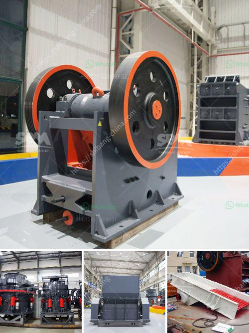

<h3>difference between primary and secondary jaw crusher</h3>
The jaw crusher is commonly used in construction and mining industries for crushing different materials such as rocks, marbles, granite, iron ore, and copper ore. The primary jaw crusher, also known as the coarse crusher, is used to crush large-size materials into small-size materials. However, the secondary jaw crusher, also known as the fine crusher, is used to crush the material into even smaller pieces.

Jaw crushers are widely used because of their efficiency in crushing different kinds of materials. Jaw crushers are used for size reduction of various materials, ranging from tough materials to brittle materials. The primary jaw crusher, on the other hand, can accommodate bigger feed sizes. While the secondary jaw crusher can handle smaller feed sizes.

Different applications and materials require different types of crushers. In the mining industry, for example, there are large-scale crushers used to crush medium to hard rock or other challenging materials too. Smaller jaw crushers can be used for certain applications like laboratory scale crushing or pilot plant operations.

Primary jaw crushers are typically used as primary crushers, or the first step in the process of reducing rock. They are considered the compression type of crusher. The material is fed into the jaw crusher by using a vibrating feeder. The reciprocating motion of the vibrating feeder transfers the material from the hopper to the jaws of the crusher.

The primary jaw crusher breaks the material through the top of the machine. During this process, the eccentric shaft is driven by a V-belt to rotate the moving jaw. The material is crushed in a crushing cavity composed of a fixed jaw plate, a moving jaw plate, and a side guard plate. The finished material is discharged through the lower part of the machine after being crushed. The size of the final product can be adjusted by changing the size of the discharge port.

The secondary jaw crusher, on the other hand, is used to crush smaller materials as compared to primary crushers. The secondary crusher is primarily used to help crush materials such as metals, minerals, and waste materials. It works on the principle of using compressive force to crush the material. Unlike the primary crusher, the secondary crusher is designed to work with smaller feed sizes.

The secondary jaw crusher is smaller in size and requires less horsepower to operate. The secondary jaw crusher can also be used to crush materials with moderate hardness. Since it requires less horsepower, it has a lower operating cost compared to the primary crusher. Additionally, it has a higher reduction ratio, which means it can crush material to a smaller size than the primary crusher.

In conclusion, the primary and secondary jaw crushers have different capacities and applications. The primary jaw crusher is used for coarse crushing while the secondary jaw crusher is used for fine crushing. Both jaw crushers have their own advantages and disadvantages, and different types of materials may require different types of crushers.
<h3>Contact us</h3><ul><li><strong>Whatsapp:&nbsp;<a href="https://wa.me/8613661969651">+8613661969651</a></strong></li><li><a href="https://swt.shibang-china.com/?git&amp;zhl&amp;difference between primary and secondary jaw crusher"><strong>Online Service(chat now)</strong></a></li></ul><h3>Related</h3><ul><li><a href='the best crusher machines.md'>the best crusher machines</a></li><li><a href='kenya stone crusher is made.md'>kenya stone crusher is made</a></li><li><a href='sandstone sand making machine manufacturer.md'>sandstone sand making machine manufacturer</a></li><li><a href='bentonite crushing manufacturing process.md'>bentonite crushing manufacturing process</a></li><li><a href='ball mill with high quality and best price.md'>ball mill with high quality and best price</a></li></ul>