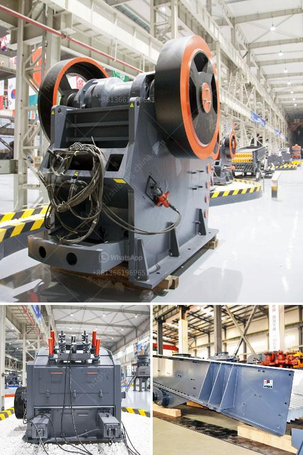

<h3>difference between underground and open cast mining</h3>
Underground mining and open cast mining are two different methods used in extracting valuable minerals or coal from the earth. Both have their advantages and disadvantages, and understanding these can help investors, contractors, and stakeholders make sound decisions on which method to use for their specific projects.

The key difference between underground mining and open cast mining lies in the depth and nature of the deposits being explored and extracted. Underground mining occurs when minerals or coal are located deep beneath the surface, making it necessary to create tunnels and shafts to reach the resource. On the other hand, open cast mining is conducted on shallow deposits, usually where the resource is close to the surface.

Underground mining offers several advantages. For one, it enables access to minerals or coal that would otherwise be unreachable by other means. Additionally, the underground environment provides a certain level of stability and safety from external disturbances. This makes it a preferred option for extracting high-value resources that are present in deep deposits. Underground mining also has a lower impact on the environment as there is minimal surface disturbance and waste production.

However, underground mining also poses certain challenges and disadvantages. The process requires significant capital investment in constructing infrastructure such as tunnels, shafts, and ventilation systems. The extraction process is often slower due to the limited access and the need for additional support structures to ensure stability. There are also safety concerns, as the underground mining environment can be hazardous, with the risk of collapses, gas leaks, and other accidents.

On the other hand, open cast mining offers its own set of advantages. It is a more cost-effective method as it requires less initial capital investment compared to underground mining. Open cast mines are faster to set up and operate, making it possible to extract resources quickly. It also allows for the use of large equipment and machinery, resulting in higher production rates. Open cast mining is also safer for workers as there are open skies, reducing the risks associated with confined spaces.

Despite these advantages, open cast mining has its own limitations and challenges. It is only suitable for shallow deposits, and the resource is often spread over a larger area, necessitating more extensive land clearance. Open cast mining has a significant impact on the environment, including deforestation, loss of biodiversity, and soil erosion. The process also generates a large amount of waste material, which must be properly managed to mitigate its environmental impact.

In conclusion, the choice between underground mining and open cast mining depends on various factors, including the depth and nature of the deposit, financial considerations, and environmental impacts. Underground mining is suitable for deep deposits and high-value resources, while open cast mining is more suitable for shallow deposits that are spread over a wider area. Both methods have their pros and cons, and stakeholders must carefully evaluate these before deciding which mining method to employ for their specific projects.
<h3>Contact us</h3><ul><li><strong>Whatsapp:&nbsp;<a href="https://wa.me/8613661969651">+8613661969651</a></strong></li><li><a href="https://swt.shibang-china.com/?git&amp;zhl&amp;difference between underground and open cast mining"><strong>Online Service(chat now)</strong></a></li></ul><h3>Related</h3><ul><li><a href='design of harmer mill.md'>design of harmer mill</a></li><li><a href='rotary dryer sales indonesia.md'>rotary dryer sales indonesia</a></li><li><a href='cost of conveyor belts.md'>cost of conveyor belts</a></li><li><a href='ball mill for manufacturing.md'>ball mill for manufacturing</a></li><li><a href='impact crusher pdf.md'>impact crusher pdf</a></li></ul>