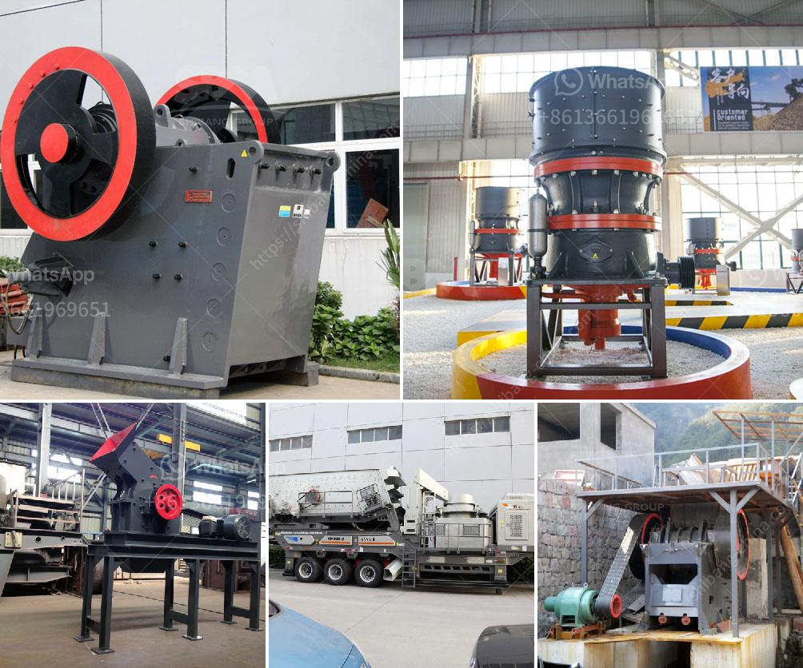

<h3>differences between jaw and gyratory crushers</h3>
Jaw and gyratory crushers are heavy equipment that are primarily used for crushing different kinds of stones and lump materials into smaller particles. Jaw crushers are widely used in the mining and construction industry due to great efficiency in every crushing tasks. They allow operators to crush the materials to a specific size by adjusting the plates at the bottom and capable of moving around the job site by using their own wheels or being pulled by any towing vehicle. Gyratory crushers, on the other hand, have a conical inner surface and use a central vertical spindle to rotate the crushing surface. Jaw crushers are primarily used for reducing various kinds of stones and lump materials into medium-grained gravel.

The materials to be crushed can be hard, medium-hard, and soft minerals whose compressive strength should be not more than 320 MPa. Our expertly crafted crushers are ideal for materials such as granite, limestone, basalt, and rock phosphate. Jaw and gyratory crushers have similar breaking angles, meaning that they break rocks by applying pressure to a rock bed. However, in case of a jaw crusher, the vertical cross-section of the crushing chamber is smaller, and it has a longer parallel zone for the discharge.

Gyratory crushers differ from cone crushers with regard to their design. In contrast to the cone crusher, which has a fixed shaft on which the power supply unit and the head rotate, the gyratory crusher has a main shaft that can be moved hydraulically in vertical direction on which the head is permanently shrink-fitted. The shaft is supported axially at the bottom end on a thrust bearing, which, in turn, is mounted on the adjusting piston. The crushing stroke of the gyratory crusher is not as large as that of a jaw crusher. It is located in the upper part of the crushing chamber, which means it has a small parallel zone compared to the long parallel zone of the standard cone crusher.

The particle size of the product is determined by the distance between the walls at the discharge end of the crusher. If the parallel size is shorter, the particle size of the product decreases. In order to control the size and quality of the product and at the same time reduce wastage, the operator should work with the manufacturer to choose the right crusher model and adjust the settings for their requirements.

In conclusion, jaw crushers and gyratory crushers are similar in terms of functioning but differ in terms of the crusher’s shape, size, and working principle. Jaw crushers are primarily used for reducing various kinds of stones and lump materials into medium-grained gravel. The materials to be crushed can be hard, medium-hard, and soft minerals whose compressive strength should be not more than 320 MPa. On the other hand, gyratory crushers have a conical inner surface and use a central vertical spindle to rotate the crushing surface. They primarily handle larger stones with a high pressure force. Therefore, they are largely used in the mining industry for primary crushing of hard and abrasive materials. Both jaw crushers and gyratory crushers have their own advantages and disadvantages and have been used in a wide range of applications over the years.
<h3>Contact us</h3><ul><li><strong>Whatsapp:&nbsp;<a href="https://wa.me/8613661969651">+8613661969651</a></strong></li><li><a href="https://swt.shibang-china.com/?git&amp;zhl&amp;differences between jaw and gyratory crushers"><strong>Online Service(chat now)</strong></a></li></ul><h3>Related</h3><ul><li><a href='used quarry machine germany.md'>used quarry machine germany</a></li><li><a href='crusher screener forsale in sweden.md'>crusher screener forsale in sweden</a></li><li><a href='vertical grinder mill for sale.md'>vertical grinder mill for sale</a></li><li><a href='stone crusher machines made in nigeria.md'>stone crusher machines made in nigeria</a></li><li><a href='cec rock crushers for sale.md'>cec rock crushers for sale</a></li></ul>