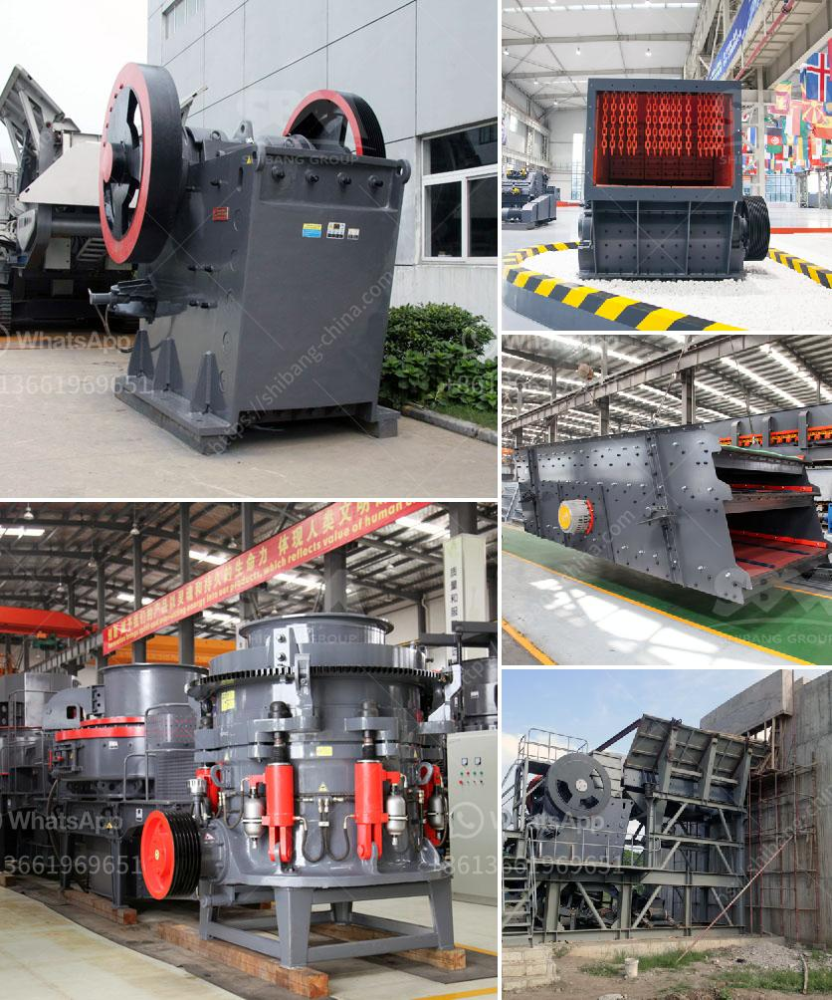

<h3>discharge chute for ball mill</h3>
A discharge chute for a ball mill is a sloping or tubular structure with a baffle at its outlet. The purpose of the discharge chute is to guide the material flow from the mill to the next stage of processing, which could be a gravity separator or a classifier. This chute prevents the balls and coarse material from backflowing into the mill, protecting the mill liners and improving the grinding efficiency.

One of the primary functions of the discharge chute is to ensure an even distribution of the ground material exiting the mill. As the comminution process in a ball mill involves both impact and attrition forces, the ground material often tends to segregate based on size and density. The discharge chute is designed with multiple openings or slots to accommodate this distribution and prevent particle accumulations that could lead to inefficiencies in downstream processes.

Furthermore, the discharge chute assists in controlling the mill's residence time, ensuring that the ground material remains in the mill for the appropriate duration. By carefully positioning the baffle at the outlet, the discharge chute helps regulate the rate at which material flows out of the mill. This is crucial for achieving the desired grind size and product quality.

In addition to its operational benefits, the discharge chute also plays a crucial role in maintaining the integrity of the ball mill. During the grinding process, the continuous impact and abrasion of the balls and ore particles can wear down the mill liners. However, by preventing the backflow of balls and coarse material, the chute helps minimize the wear and tear on those liners, extending their lifespan and reducing maintenance costs.

Designing an effective discharge chute for a ball mill involves considering several factors. Firstly, the chute dimensions must be compatible with the mill's size and capacity. It should be wide enough to handle the anticipated material flow rate without causing blockages, but not so wide that it reduces the grinding efficiency. The chute should also have a suitable slope to promote the smooth flow of material.

Additionally, the material properties, such as particle size distribution, density, and abrasiveness, must be taken into account when designing the chute. These properties influence the chute's geometry, liner material selection, and wear protection requirements. For example, if the material is highly abrasive, it may be necessary to install replaceable wear liners or apply wear-resistant coatings to the chute surfaces.

In conclusion, a well-designed discharge chute for a ball mill is essential for optimizing mill performance, protecting mill liners, and maintaining product quality. By providing a controlled flow of ground material, the chute enables efficient separation and classification of particles, enhances grinding efficiency, and reduces maintenance costs. When designing a discharge chute, various factors such as mill size, capacity, material properties, and wear protection requirements must be considered. Ultimately, an effective discharge chute contributes to the overall success of the milling process.
<h3>Contact us</h3><ul><li><strong>Whatsapp:&nbsp;<a href="https://wa.me/8613661969651">+8613661969651</a></strong></li><li><a href="https://swt.shibang-china.com/?git&amp;zhl&amp;discharge chute for ball mill"><strong>Online Service(chat now)</strong></a></li></ul><h3>Related</h3><ul><li><a href='model project of soap stone powder.md'>model project of soap stone powder</a></li><li><a href='conventional hammer mills.md'>conventional hammer mills</a></li><li><a href='small diesel engine crusher from tanzania.md'>small diesel engine crusher from tanzania</a></li><li><a href='price of marble grinder mill.md'>price of marble grinder mill</a></li><li><a href='write an article about jaw crusher philippines prices with 100300 words.md'>write an article about jaw crusher philippines prices with 100-300 words</a></li></ul>