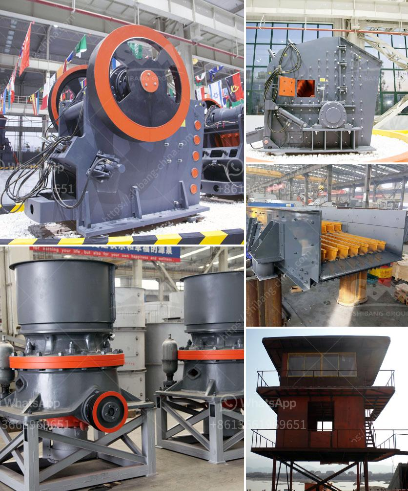

<h3>dolamite powder machine</h3>
Dolomite powder machine is crucial equipment in dolomite processing plant. It is used to grind dolomite into powder to make the complete dolomite production line. The Dolomite powder machine can produce dolomite powder ranging from 325 mesh to 1,250 mesh, and the machine has high grinding efficiency, low power consumption, and convenient maintenance.

Dolomite is a carbonate mineral, which is widely used in various industries. It is a natural mineral composed of calcium magnesium carbonate. Dolomite powder has a wide range of applications, such as in glass manufacturing, medical industry, cosmetics, building materials, ceramics, agriculture, and environmental protection.

The Dolomite powder machine plays a significant role in the production process of dolomite powder. It uses mechanical methods to crush dolomite raw materials into powder form. The particle size of the final product can be adjusted from 30-400 mesh. The equipment adopts advanced grinding technology and is suitable for grinding various non-flammable and explosive materials with Mohs hardness below 9.3 and humidity below 6%.

The Dolomite powder machine has several advantages over traditional mills. First, it has a high grinding efficiency. The machine adopts the principle of material layer grinding, and the material stays in the mill for a short time, which greatly improves the grinding efficiency. Second, it has a low power consumption. The special grinding roller assembly design reduces the power consumption of the machine while ensuring the output. Third, it has a convenient maintenance. The machine has a simple structure and is easy to operate and maintain. The wearing parts are made of high-quality materials, which can extend the service life of the equipment.

In addition to these advantages, the Dolomite powder machine also has a wide range of applications. It can process various non-flammable and explosive materials with a hardness below 9.3 and a humidity below 6%. It can be used in the production of limestone, gypsum, barite, dolomite, talc, calcite, marble, kaolin, bentonite, feldspar, talc, gypsum, graphite, and other minerals. The machine is suitable for grinding non-flammable and explosive materials with a Mohs hardness below 9.3 and a humidity below 6%, such as barite, limestone, ceramics, and slag in high fine powder processing.

To conclude, the Dolomite powder machine is an essential equipment in the production of dolomite powder. It has high grinding efficiency, low power consumption, and convenient maintenance. The machine can produce dolomite powder ranging from 325 mesh to 1,250 mesh, making it suitable for various industries. With its advanced grinding technology, it can grind various non-flammable and explosive materials, providing a reliable solution for the production of high-quality dolomite powder.
<h3>Contact us</h3><ul><li><strong>Whatsapp:&nbsp;<a href="https://wa.me/8613661969651">+8613661969651</a></strong></li><li><a href="https://swt.shibang-china.com/?git&amp;zhl&amp;dolamite powder machine"><strong>Online Service(chat now)</strong></a></li></ul><h3>Related</h3><ul><li><a href='crusher application.md'>crusher application</a></li><li><a href='stone crushers machinery in south africa.md'>stone crushers machinery in south africa</a></li><li><a href='difference between jaw crusher and cone crusher.md'>difference between jaw crusher and cone crusher</a></li><li><a href='lime and dolomite plant division.md'>lime and dolomite plant division</a></li><li><a href='gemstone mining crusher in zambia.md'>gemstone mining crusher in zambia</a></li></ul>