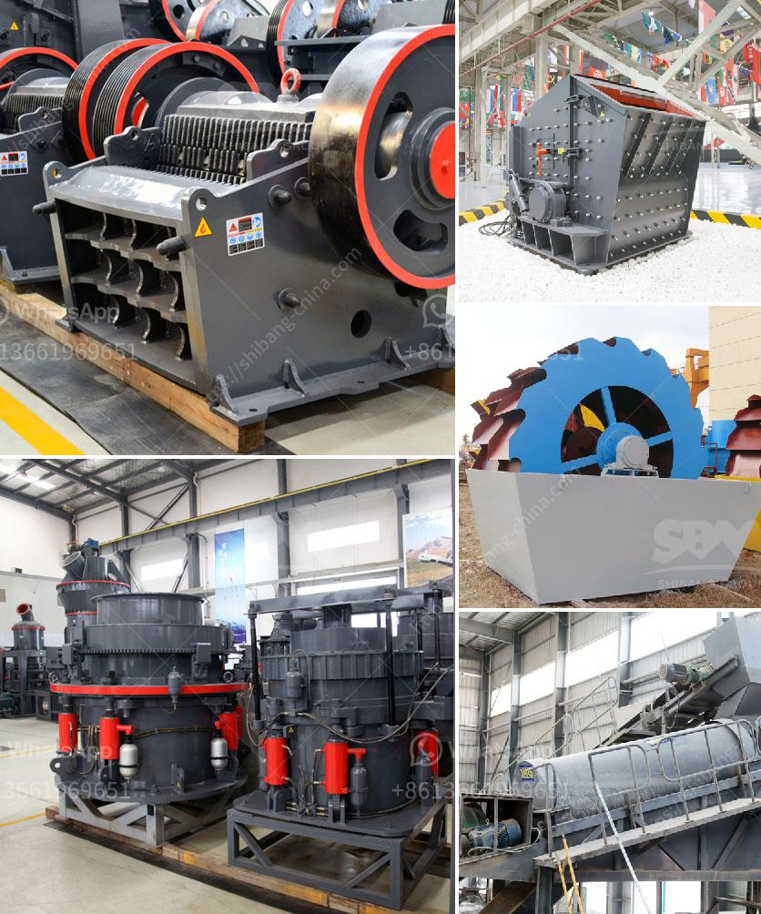

<h3>dolomite crusher manufacturer in usa</h3>
Dolomite is a calcium magnesium carbonate mineral that has many characteristics similar to calcite. With the increasing demand for dolomite, the market for dolomite crusher manufacturers in the United States is also growing. However, our country's dolomite crusher manufacturers are also catching up with the development trend and constantly improving their technology to compete with foreign companies.

Firstly, the dolomite crusher manufacturer in the United States chooses to increase the research and development of the new generation of dolomite crusher because of its obvious advantages such as large crushing capacity, reliable operation, energy saving and environmental protection. The traditional dolomite crusher relies on single crushing equipment, but the modern dolomite crusher manufacturer in the United States optimizes the design and produces a variety of dolomite crushers with different specifications on the market. The crushing operation of dolomite in the United States is very practical and economic because the dolomite in the United States has low hardness and good crushing performance.

Secondly, the dolomite crusher manufacturer in the United States pays great attention to improve the application field of dolomite, and the level of beneficiation is increased. At this stage, only a small amount of dolomite can pass through the grinding process, but the majority of dolomite needs to go through the crushing process to become a small particle, and then send it to the grinding mill for further grinding. Therefore, the dolomite crusher manufacturer in the United States can only rely on external forces to create the market and follow the pace of the international market, so as to obtain long-term development.

Thirdly, the dolomite crusher manufacturer in the United States needs to concentrate on improving the automation level of their equipment. In the developed countries, the automation level of the crushing equipment has been greatly improved, which can not only improve the stability of the equipment but also save the labor cost and improve the work efficiency. The dolomite crusher manufacturer in the United States should establish a sound mechanical operation system and implement standardized production management as soon as possible, so as to meet the requirements of the market and customers.

In conclusion, as the demand for dolomite in the United States continues to rise, the dolomite crusher manufacturer in the United States has seized market opportunities to innovate and improve the technology and manufacturing level of dolomite crushers. By increasing the research and development of new technology, expanding the application range of dolomite, and improving the automation level of equipment, the dolomite crusher manufacturers in the United States are striving for long-term development and competing with foreign companies. It is believed that with the joint efforts of government support, technology research and development, and market demand, the dolomite crusher manufacturers in the United States will achieve even greater development in the future.
<h3>Contact us</h3><ul><li><strong>Whatsapp:&nbsp;<a href="https://wa.me/8613661969651">+8613661969651</a></strong></li><li><a href="https://swt.shibang-china.com/?git&amp;zhl&amp;dolomite crusher manufacturer in usa"><strong>Online Service(chat now)</strong></a></li></ul><h3>Related</h3><ul><li><a href='equipment required for producing lime for new plant.md'>equipment required for producing lime for new plant</a></li><li><a href='density of fine aggregate granite.md'>density of fine aggregate granite</a></li><li><a href='hammer mill diagram.md'>hammer mill diagram</a></li><li><a href='mobile crushers for hire in gauteng south africa.md'>mobile crushers for hire in gauteng south africa</a></li><li><a href='italia dry mortar production line supplier.md'>italia dry mortar production line supplier</a></li></ul>