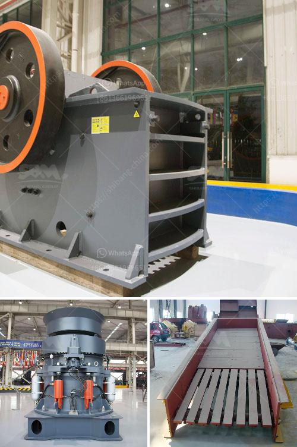

<h3>dolomite crushing production line equipment</h3>
Dolomite is widely used in building materials, ceramics, glass, refractory materials, chemicals, agriculture, environmental protection, energy conservation and other fields. As a valuable resource of magnesium in the nature, dolomite is often used in the production of magnesium oxide, magnesium sulfate, dolomite refractory materials, and dolomite cement. With the continuous development of modern technology, the demand for dolomite powder is increasing, and many industries have a growing desire for dolomite powder.

The dolomite crushing production line equipment is mainly composed of jaw crusher, impact crusher, cone crusher, vibrating screen, vibrating feeder, conveyor and other equipment. It is an indispensable crushing equipment for various mineral processing production lines. It can break various ores with compressive strength not exceeding 320MPa. Its processing capacity is 1-1000 tons per hour, which is suitable for various large, medium and small scale stone processing plants.

The large dolomite material is crushed by the crusher to the fineness required by the downstream operations, such as sand making and shaping.

Dolomite can be formed into various shapes, such as cube, diamond, and hexagonal. During the sand making process, the dolomite raw material is evenly fed into the jaw crusher by the vibrating feeder for coarse crushing, and then transported to the impact crusher for fine crushing. After the two stages of crushing, the dolomite material is sieved by the vibrating screen and the dolomite sand with mesh size of 5-10mm, 10-20mm, or 20-40mm can be obtained. It is suitable for various construction projects.

The crushed dolomite material is transported to the impact crusher for secondary crushing by the vibrating screen. After secondary crushing, the dolomite material is sieved through the circular vibrating screen. The dolomite material larger than the finished product is returned to the impact crusher for re-crushing. Depending on the actual production situation, the cone crusher or impact crusher can be selected to meet the requirements of the dolomite particle size.

The dolomite material that is produced through the shaping stage is turned into dolomite powder by the grinding equipment. After being transferred to the grinder by the belt conveyor, the dolomite material undergoes various processes such as crushing, grinding, cleaning, dehydration, and classification, and finally becomes a fine powder of different grades. The dolomite powder can be used as a filler in the production of paint, rubber, plastics, and other products, and can also be used in the production of cement, ceramics, glass, and refractory materials.

In summary, dolomite crushing production line equipment is an important link in the construction industry. It is an indispensable crushing equipment in the production of dolomite powder. It has the advantages of high efficiency and large processing capacity. It is praised and welcomed by users in the industry.
<h3>Contact us</h3><ul><li><strong>Whatsapp:&nbsp;<a href="https://wa.me/8613661969651">+8613661969651</a></strong></li><li><a href="https://swt.shibang-china.com/?git&amp;zhl&amp;dolomite crushing production line equipment"><strong>Online Service(chat now)</strong></a></li></ul><h3>Related</h3><ul><li><a href='pulverized coal mill.md'>pulverized coal mill</a></li><li><a href='grinding mill price.md'>grinding mill price</a></li><li><a href='crushing and screening plants.md'>crushing and screening plants</a></li><li><a href='rock crusher plants in germany.md'>rock crusher plants in germany</a></li><li><a href='iron ore processing equipment cost.md'>iron ore processing equipment cost</a></li></ul>