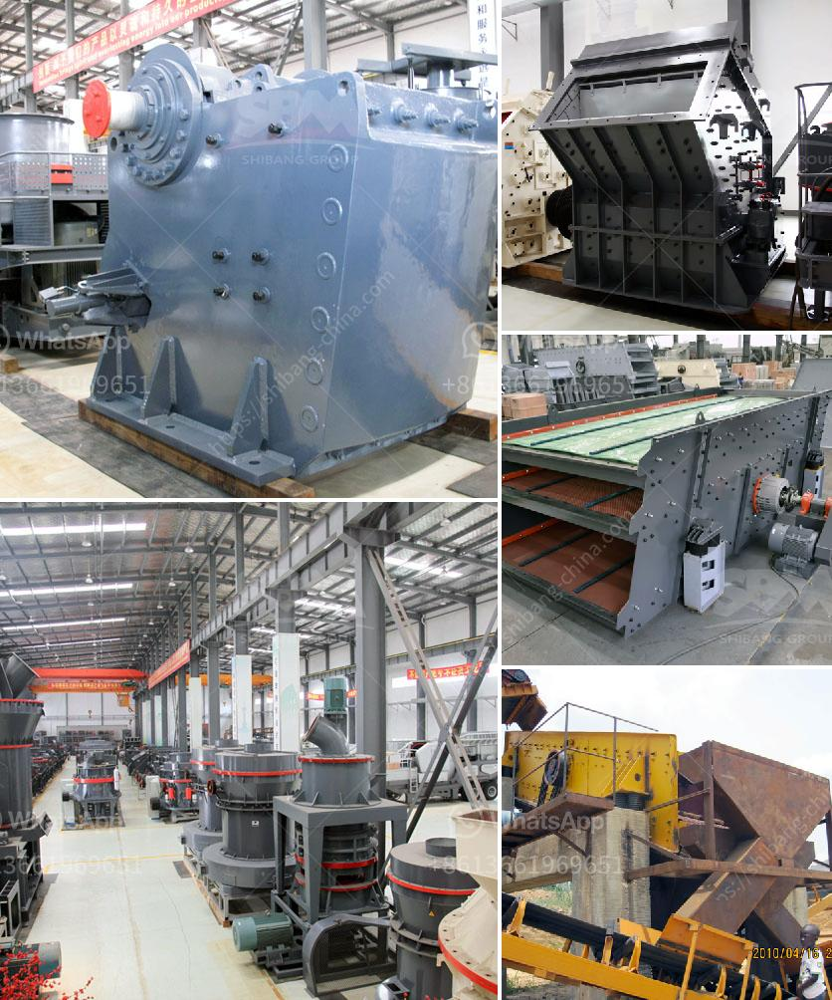

<h3>dolomite grinding mill for sale in india</h3>
Dolomite is a common mineral, which has a crystalline structure and a distinctive curved crystal shape. It is mainly composed of calcium carbonate and magnesium carbonate, making it a valuable resource for various industrial purposes. One of the main uses of dolomite is in the production of construction materials, such as cement, concrete, and asphalt. However, dolomite can also be processed into other forms, such as dolomite powder, for various applications.

In India, dolomite grinding mills are a main type of powdering machines. As a professional dolomite grinding mill manufacturer in India, SBM provides various dolomite grinding mills for sale, including ball mill, Raymond mill, vertical mill, high pressure mill, coarse powder mill, ultrafine mill, and trapezium mill, etc. According to the customer's requirements and the actual condition of the production site, SBM can provide the most suitable dolomite grinding mill for customers.

The whole dolomite grinding mill production line includes crushing stage, grinding stage and beneficiation stage. In the crushing stage, large block dolomite extracted from the mine is crushed into small particles with a diameter of 40mm by a crusher. The crushed dolomite particles are sent to the storage hopper by the elevator, and then sent to the grinding chamber of the mill evenly and quantitatively by the vibrating feeder for grinding.

In the grinding stage, the dolomite particles are ground to a certain fineness by the grinding mill. The grinding process is divided into three steps: crushing, grinding, and grading. The crushed dolomite particles are sent to the storage hopper by the elevator and then evenly and quantitatively sent to the grinding chamber of the mill by the vibrating feeder for grinding. The ground dolomite powder is classified by the classifier and the unqualified particles are returned to the grinding chamber for grinding again.

In the beneficiation stage, the qualified dolomite powder is collected by the dust collector, and then transported to the finished product storage area by the conveyor for packaging. The dolomite grinding mill has the advantages of high grinding efficiency, low power consumption, large feed size, easy adjustment of product fineness, simple process flow, small occupied area, low noise, and low dust pollution.

In conclusion, the dolomite grinding mill is a powerful assistant to improve the efficiency of dolomite processing. SBM provides various dolomite grinding mills for customers in India. With the rapid development of construction industry and the increasing demand for dolomite, dolomite grinding mills are in high demand in India. SBM provides various types and models of dolomite grinding mills for sale, aimed at meeting customers' needs and creating more value for customers. If you are interested in dolomite grinding mills, please feel free to contact SBM for more information.
<h3>Contact us</h3><ul><li><strong>Whatsapp:&nbsp;<a href="https://wa.me/8613661969651">+8613661969651</a></strong></li><li><a href="https://swt.shibang-china.com/?git&amp;zhl&amp;dolomite grinding mill for sale in india"><strong>Online Service(chat now)</strong></a></li></ul><h3>Related</h3><ul><li><a href='crusher price malaysia.md'>crusher price malaysia</a></li><li><a href='sample business plan for a stone mining.md'>sample business plan for a stone mining</a></li><li><a href='slag crusher plant manufacturer india.md'>slag crusher plant manufacturer india</a></li><li><a href='ball mill for aluminum powder.md'>ball mill for aluminum powder</a></li><li><a href='coarse ash grinding mill equipment.md'>coarse ash grinding mill equipment</a></li></ul>