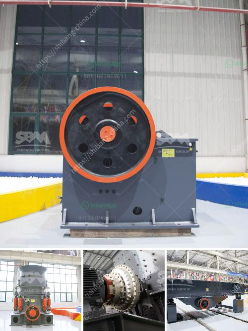

<h3>dolomite mining plant price</h3>
Dolomite mining is an integral part of the industrial sector in many countries, especially those which possess significant reserves of this mineral. This mineral is used widely in various industries such as steel-making, glass manufacturing, construction, agriculture, pharmaceuticals, cosmetics, and even food processing. Therefore, dolomite mining plant price holds significant importance for investors and operators in the mining industry.

The price of a dolomite mining plant depends on several factors, including the equipment, location, and scale of operations. Generally, large-scale mining plants require a substantial investment due to the significant amount of machinery and equipment needed. These plants often employ advanced technologies and automation systems to ensure efficiency and productivity. As a result, the price for setting up a large-scale dolomite mining plant can be substantial.

On the other hand, smaller mining plants have a lower price due to reduced requirements in terms of equipment, workforce, and the overall scale of operations. These smaller plants are typically designed to cater to local demand or serve as a supplier to larger cement and steel manufacturing companies.

The location of the mining plant also plays a crucial role in determining the price. Areas with abundant dolomite reserves usually have a lower price due to ease of access and transportation costs. On the contrary, plants located in remote or geographically challenging regions might face higher prices due to the additional expenses involved in logistics and infrastructure development.

Another factor affecting the price of a dolomite mining plant is the extraction method used. There are different methods available for extracting dolomite, such as open-pit mining, underground mining, and quarrying. Each method has different cost implications, which ultimately influence the plant price. Open-pit mining is often more cost-effective as it requires less infrastructure and labor compared to underground mining.

Apart from these factors, the market demand and supply dynamics for dolomite also have a significant impact on the plant price. The price of dolomite is influenced by several market factors, including economic conditions, construction activities, industrial production, and environmental regulations. Fluctuations in the demand and supply of dolomite can directly impact the price and profitability of dolomite mining plants.

It is essential for investors and operators to conduct thorough market research and feasibility studies before investing in a dolomite mining plant. This analysis can help determine the potential profitability of the plant in relation to the anticipated price. Moreover, it allows for cost optimization and strategic planning to ensure a competitive advantage in the market.

In conclusion, the price of a dolomite mining plant depends on various factors, including equipment, location, extraction method, market demand, and supply dynamics. Both large-scale and small-scale mining plants have different price ranges based on their specific requirements and operations. Conducting a comprehensive analysis of these factors is essential for investors and operators to make informed decisions and ensure profitability in the dolomite mining industry.
<h3>Contact us</h3><ul><li><strong>Whatsapp:&nbsp;<a href="https://wa.me/8613661969651">+8613661969651</a></strong></li><li><a href="https://swt.shibang-china.com/?git&amp;zhl&amp;dolomite mining plant price"><strong>Online Service(chat now)</strong></a></li></ul><h3>Related</h3><ul><li><a href='trommel screen suppliers in india.md'>trommel screen suppliers in india</a></li><li><a href='high capacity r ore raymond mill with competitive price.md'>high capacity r ore raymond mill with competitive price</a></li><li><a href='crushing and mining machine.md'>crushing and mining machine</a></li><li><a href='gravel making equipment.md'>gravel making equipment</a></li><li><a href='calcite crusher for sale.md'>calcite crusher for sale</a></li></ul>