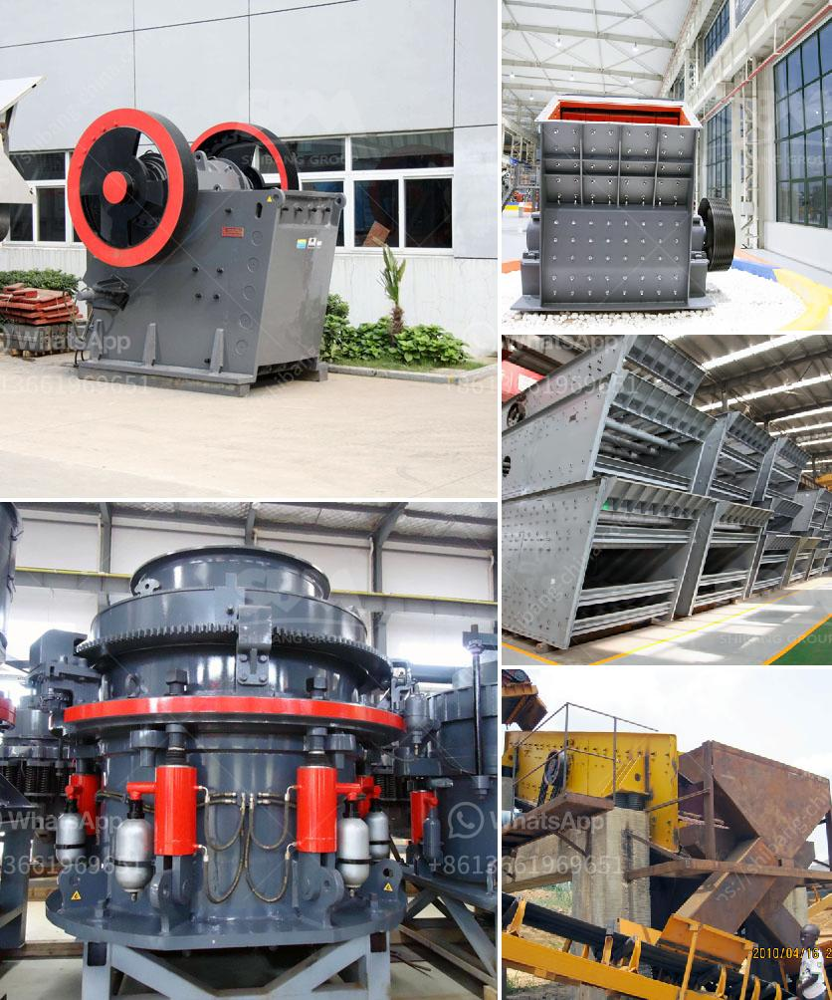

<h3>dolomite powder grinding mill in india</h3>
Dolomite powder grinding mill in India is an efficient tool for grinding various kinds of rocks and other materials into fine powder. They are extensively used in various industries such as mining, construction, metallurgy, chemicals, and others. It is widely used in the cement industry for the grinding process of limestone, slag, clinker, and other materials. The dolomite powder grinding mill in India is also used in the chemical and metallurgical industries to grind the ores and minerals.

The dolomite powder grinding mill in India is equipped with a state-of-the-art integrated power supply system, which ensures uninterrupted and stable operation. The grinding chamber is made of high-quality stainless steel, which ensures the durability and strength of the mill. The machine can be easily adjusted to various particle sizes and is highly efficient in grinding the materials.

One of the main advantages of using the dolomite powder grinding mill in India is its ability to produce finely ground powder. This machine can grind the materials to a particle size of 2500-3000 mesh, ensuring the high-quality output. The machine also has a low energy consumption, which means lower electricity bills for the user.

In addition, the dolomite powder grinding mill in India also has many other advantages. It has a high grinding efficiency, low maintenance cost, and easy operation. The machine is also equipped with a dust removal system, which ensures a clean and healthy working environment.

Overall, the dolomite powder grinding mill in India is an excellent tool for grinding various rocks and minerals into fine powder. It is widely used in various industries and has many advantages. With its high grinding efficiency and low maintenance cost, it is a popular choice among customers.
<h3>Contact us</h3><ul><li><strong>Whatsapp:&nbsp;<a href="https://wa.me/8613661969651">+8613661969651</a></strong></li><li><a href="https://swt.shibang-china.com/?git&amp;zhl&amp;dolomite powder grinding mill in india"><strong>Online Service(chat now)</strong></a></li></ul><h3>Related</h3><ul><li><a href='rock crusher 500 cubic metre per day.md'>rock crusher 500 cubic metre per day</a></li><li><a href='small cement grinding machine.md'>small cement grinding machine</a></li><li><a href='rock crushing machine suppliers.md'>rock crushing machine suppliers</a></li><li><a href='mining equipment for sale zimbabwe.md'>mining equipment for sale zimbabwe</a></li><li><a href='machine for gypsum factory from philippines.md'>machine for gypsum factory from philippines</a></li></ul>