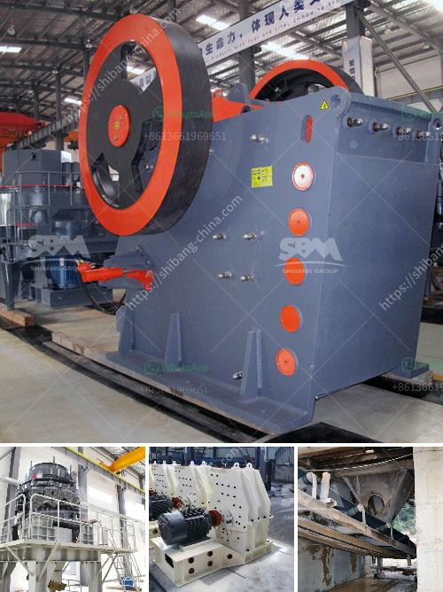

<h3>dolomite sand composition</h3>
Dolomite sand, also known as dolostone or dolomite rock, is a sedimentary rock composed primarily of the mineral dolomite. It is commonly used in construction and as a source of magnesium for various industries. Understanding the composition of dolomite sand is vital to understanding its properties and potential applications.

Dolomite sand is formed through the deposition and compaction of sedimentary particles, typically in marine environments. It is often found in association with limestone, another common sedimentary rock composed mainly of the mineral calcite. Dolomite sand differs from limestone due to its high magnesium content, which ranges from 10 to 50 percent.

Chemically, dolomite sand is composed of calcium magnesium carbonate (CaMg(CO3)2). It is a double carbonate mineral, consisting of a calcium carbonate component (calcite) and a magnesium carbonate component (dolomite). This unique composition gives dolomite sand some distinct properties that make it useful for several applications.

The ratio of calcium to magnesium in dolomite sand can vary, leading to different types of dolomite. Calcium-rich dolomite has a high calcium to magnesium ratio, while magnesium-rich dolomite has a higher magnesium to calcium ratio. These variations in composition can affect the properties of dolomite sand, such as its hardness, density, and solubility.

One of the significant advantages of dolomite sand is its high magnesium content. Magnesium is an essential mineral for various industrial processes, especially in the production of metals, glass, and ceramics. Dolomite sand is often processed to extract magnesium for these applications. Its abundance and relatively low cost make it an attractive source of this vital material.

In construction, dolomite sand is widely used as an aggregate in concrete and asphalt mixtures. Its unique composition, hardness, and durability make it an excellent material for road and building construction. Dolomite sand is also commonly used as a base material under roads and buildings to provide stability and prevent settling.

Another application of dolomite sand is in agriculture. It is used as a soil conditioner to help neutralize acidic soils and provide essential nutrients, particularly magnesium and calcium, to plants. Dolomite sand's ability to increase soil pH and improve nutrient availability makes it valuable in farming and gardening.

However, the unique composition of dolomite sand can also present challenges. Due to its high magnesium content, it can react with acidic water, releasing magnesium ions and increasing the water's alkalinity. This reaction can make the water unsuitable for some aquatic organisms, affecting ecosystems.

In conclusion, dolomite sand is a sedimentary rock composed primarily of calcium magnesium carbonate. Its unique composition, which includes a high magnesium content, makes it suitable for various applications, including construction, the production of magnesium, and agricultural use. Understanding the composition of dolomite sand is crucial in ensuring its optimal utilization and addressing potential challenges associated with its properties.
<h3>Contact us</h3><ul><li><strong>Whatsapp:&nbsp;<a href="https://wa.me/8613661969651">+8613661969651</a></strong></li><li><a href="https://swt.shibang-china.com/?git&amp;zhl&amp;dolomite sand composition"><strong>Online Service(chat now)</strong></a></li></ul><h3>Related</h3><ul><li><a href='coal crusher machine.md'>coal crusher machine</a></li><li><a href='used aggregate crushing plant for sale.md'>used aggregate crushing plant for sale</a></li><li><a href='stone crusher plant 80 ton.md'>stone crusher plant 80 ton</a></li><li><a href='crushing plant thailand.md'>crushing plant thailand</a></li><li><a href='vertical shaft impact crusher.md'>vertical shaft impact crusher</a></li></ul>