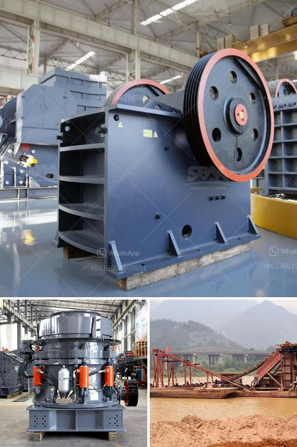

<h3>dolomite stone crusher plant</h3>
Dolomite stone is widely used in various industries such as refractory, water conservancy, chemistry, building material and construction. Since dolomite is extensively available, it is utilized in various fields as a valuable resource.

Crushing is the integral process in stone quarry plant. It reduces the large materials into small particle size and prepares for furhter processing. We provide high quality efficient dolomite stone crushers for sale in India and all over the world.

Dolomite stone crusher plant are adjustable for different production requirements in quarries. Depending on the actual requirements, Dolomite stone crushing plant can be operated either as independent units, or as two-stage crushing plant with primary and secondary crushing stages. The crushed dolomite materials will then be transferred to vibrating screen for separating. After separating, the parts that can meet standard will be transferred away as final products, while the other parts will be returned to impact crusher, thus forming a closed circuit. Size of final products can be combined and graded according to customers' specific requirement. We can also equip dust catcher system to protect the environment.

The dolomite stone crushing plant is equipped with primary crushing equipment, secondary crushing equipment, vibrating feeder, vibrating screen, belt conveyor, and so on.

Primary crushing equipment is jaw crusher, which is called as primary crusher. After primary crushing, the final products can be screened to separate the large particle size and small particle size. Small particle size materials will be sent to the impact crusher for secondary crushing and shaping. Then dolomite materials will be transferred to vibrating screen for separating. The parts with desired sizes will be gravely separated with the vibrating screens and conveyed to the product area. And the oversize particles will return to the cone crusher or impact crusher for re-crushing.

Big Dolomite materials are fed to the jaw crusher evenly and gradually by vibrating feeder through a hopper for primary crushing. After first crush, the material will transferred to impact crusher by belt conveyor for secondary crush; the crushed dolomite materials will then transferred to vibrating screen for separating. After separating, the parts that can meet standard will be transferred away as final products, while the other parts will be returned to impact crusher, thus forming a closed circuit. Size of final products can be combined and graded according to customers' specific requirement. We can also equip dust catcher system to protect the environment.

With the modern and advanced technology, the advanced crushing equipment becomes important for dolomite stone crushing. It is necessary to choose the dolomite crushing system with a little wear and tear, equipment should be stable, reliable operation, dolomite quarry stone breaker, drop ball breaker should be exported to the developed countries in Europe and America, the Middle East, South Africa and other countries.

In conclusion, based on the above analysis and information, it is clear that the dolomite stone crusher plant plays an important role in the industrial development and economic growth of the dolomite quarry area. We provide high quality dolomite stone crusher plant solution on competitive price. If you are interested, please feel free to contact us for more information.
<h3>Contact us</h3><ul><li><strong>Whatsapp:&nbsp;<a href="https://wa.me/8613661969651">+8613661969651</a></strong></li><li><a href="https://swt.shibang-china.com/?git&amp;zhl&amp;dolomite stone crusher plant"><strong>Online Service(chat now)</strong></a></li></ul><h3>Related</h3><ul><li><a href='crusher prices stone crusher.md'>crusher prices stone crusher</a></li><li><a href='jaw crusher each equipment.md'>jaw crusher each equipment</a></li><li><a href='jaw crusher machine in dubai.md'>jaw crusher machine in dubai</a></li><li><a href='bentonite processing machinery.md'>bentonite processing machinery</a></li><li><a href='belt conveyor belt suppliers in oman.md'>belt conveyor belt suppliers in oman</a></li></ul>