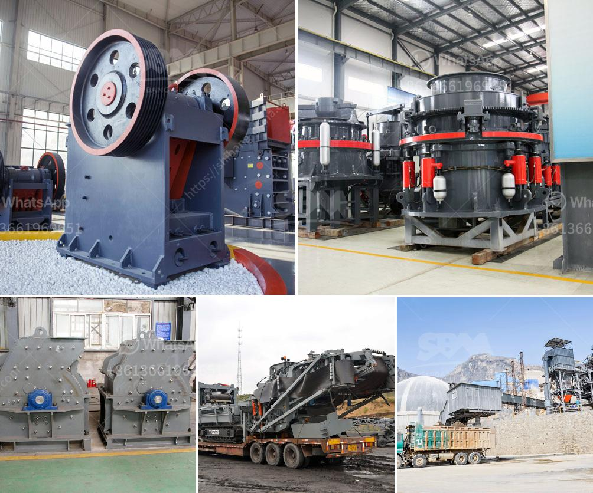

<h3>domestic mobile crusher</h3>
The mobile crushing plant is a much-needed innovation in today’s construction and mining industry. It has brought a significant transformation in the way operations are carried out. Gone are the days when huge rocks and boulders needed to be manually broken down into smaller pieces. With the advent of mobile crushers, machinery can now process the material on-site, saving time, cost, and efforts.

In the past, many operations were reliant on fixed crushing plants which required transportation of the material to and from the site. This cumbersome process often resulted in delays, additional expenses, and even environmental concerns due to the emission of dust and fumes. However, the introduction of domestic mobile crusher has changed the ballgame completely.

The domestic mobile crusher is a key player in various infrastructure development projects across the country. The crushing equipment is equipped with advanced features and functions which boost productivity for the contractor. By allowing operators to efficiently process materials right on-site, they eliminate the need to transport the material to a distant location for processing. This not only saves time but also reduces transportation costs and lowers the risks associated with material transportation.

One of the standout features of the domestic mobile crusher is its flexibility. It can be easily maneuvered and transported from one site to another. This allows contractors to use the crusher at multiple sites without the need for additional machinery or infrastructure. It ensures maximum utilization of resources while minimizing operational expenses.

The mobile crusher also provides an environmentally friendly solution by reducing the emission of dust and noise. These crushers are equipped with advanced dust suppression systems that minimize the release of harmful particles into the air. The noise levels are significantly reduced, ensuring a peaceful working environment for the operators and nearby residents.

Another advantage of domestic mobile crushers is their ability to handle a wide range of materials. Whether it's natural rocks, concrete debris, or asphalt, the crusher can efficiently process them all. This versatility makes the equipment suitable for use in various construction and mining projects.

Not only do domestic mobile crushers excel in traditional crushing applications, but they also offer innovative features tailored to meet the changing demands of the industry. Some crushers are equipped with advanced technology that allows them to facilitate the recycling of construction waste. They can efficiently process demolition waste into reusable materials, reducing the need for new raw materials and conserving the environment.

In conclusion, domestic mobile crushers have emerged as a game-changer in the crushing industry. They have revolutionized the way construction and mining operations are carried out by allowing on-site processing of materials. With their flexibility, mobility, and advanced features, they offer numerous benefits to contractors, including cost savings, increased productivity, and reduced environmental impact. As the crushing industry continues to evolve, the domestic mobile crusher remains at the forefront, paving the way for more efficient and sustainable operations.
<h3>Contact us</h3><ul><li><strong>Whatsapp:&nbsp;<a href="https://wa.me/8613661969651">+8613661969651</a></strong></li><li><a href="https://swt.shibang-china.com/?git&amp;zhl&amp;domestic mobile crusher"><strong>Online Service(chat now)</strong></a></li></ul><h3>Related</h3><ul><li><a href='marble grinder mill machine price in pakistan.md'>marble grinder mill machine price in pakistan</a></li><li><a href='bentonite crushing manufacturing process.md'>bentonite crushing manufacturing process</a></li><li><a href='mobile coal crusher for sale in south africa.md'>mobile coal crusher for sale in south africa</a></li><li><a href='stone crusher plant list odisha.md'>stone crusher plant list odisha</a></li><li><a href='grinding marble stone price.md'>grinding marble stone price</a></li></ul>