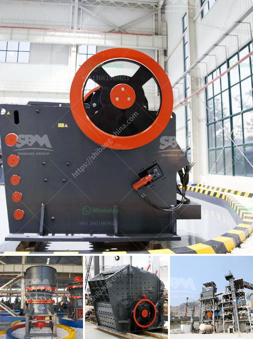

<h3>domestic stone crushers</h3>
Domestic stone crushers are essential equipment in mining machinery, which are primarily used to crush large stones into smaller rocks, gravel, or rock dust. These machines are commonly found in quarries, construction sites, and recycling centers.

Stone crushers are used to break down rocks of various hardnesses and sizes. They can easily handle materials like limestone, concrete, and other types of stones, with high crushing efficiency and reliable performance. Some of the key features of domestic stone crushers include robust construction, low maintenance requirements, and ease of operation.

One of the main advantages of using a stone crusher is that it helps save time and energy. Crushing stones manually or using outdated machinery is time-consuming and requires a lot of physical labor. However, with domestic stone crushers, the process becomes much simpler and more efficient. These machines are designed to automate the crushing process, reducing manual labor and increasing productivity. Moreover, they can be operated by a single person, making it cost-effective and less time-consuming.

Another advantage of using domestic stone crushers is their ability to produce a consistent and high-quality end product. These machines are equipped with advanced technology that ensures uniform crushing and minimum dust generation. The crushed stones can be used for various purposes like building roads, constructing buildings, and manufacturing concrete. Additionally, the uniformly crushed stones are easier to handle and transport, saving costs and resources.

Domestic stone crushers are also known for their versatility. They can be used in various applications, including tertiary and quaternary crushing stages in aggregate production lines. In addition, they can be used for primary crushing in stone quarries. The wide range of capabilities makes these crushers suitable for different industries, such as mining, construction, and recycling.

When choosing a domestic stone crusher, it is essential to consider factors like the type and hardness of the material to be crushed, the required size of the end product, and the desired capacity. Additionally, factors like energy consumption, maintenance requirements, and after-sales service should also be taken into account.

It is worth mentioning that domestic stone crushers are available in different sizes and configurations to meet various needs. Some machines are mobile, allowing them to be transported easily to different locations. Depending on the specific requirements of the project, there are different types of crushers available, including jaw crushers, cone crushers, impact crushers, and hammer crushers.

In conclusion, domestic stone crushers play a crucial role in the mining and construction industries. These machines provide efficient and cost-effective solutions for breaking down stones into smaller rocks, gravel, or dust. With their advanced technology, robust construction, and versatility, domestic stone crushers are the ideal choice for various applications. Whether it is crushing stones in quarries or recycling materials in construction sites, these machines offer reliable performance, high crushing efficiency, and consistent end product quality.
<h3>Contact us</h3><ul><li><strong>Whatsapp:&nbsp;<a href="https://wa.me/8613661969651">+8613661969651</a></strong></li><li><a href="https://swt.shibang-china.com/?git&amp;zhl&amp;domestic stone crushers"><strong>Online Service(chat now)</strong></a></li></ul><h3>Related</h3><ul><li><a href='cost of gold beneficiation plant.md'>cost of gold beneficiation plant</a></li><li><a href='list of crushers companies in malaysia.md'>list of crushers companies in malaysia</a></li><li><a href='mobile stone crusher price in zimbabwe.md'>mobile stone crusher price in zimbabwe</a></li><li><a href='mini concrete crusher.md'>mini concrete crusher</a></li><li><a href='copper ore crushing plant brazil.md'>copper ore crushing plant brazil</a></li></ul>