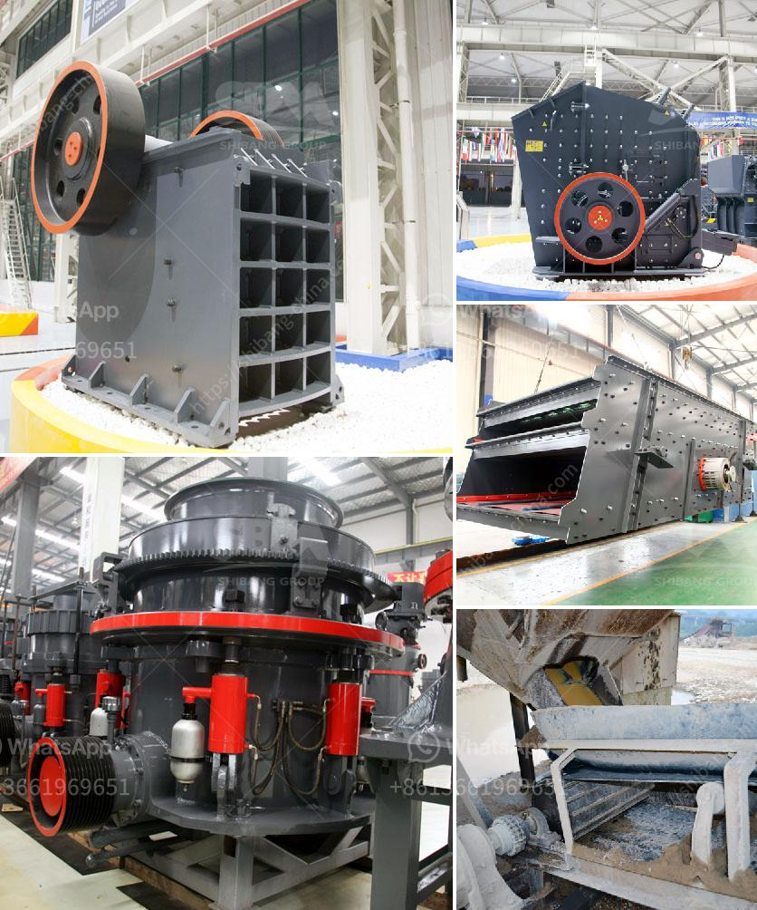

<h3>double deck bunch crusher</h3>
The double deck bunch crusher is a highly efficient and versatile machine designed to effectively break down large clusters of oil palm fruits. This innovative crusher utilizes a double deck system that separates the fruit clusters into two different sizes before crushing them. With its unique features and functionality, this crusher provides substantial benefits to oil palm plantations, enhancing productivity and improving overall efficiency.

One of the key advantages of the double deck bunch crusher is its ability to process large quantities of fruit bunches in a short period of time. Its dual deck system allows for simultaneous processing of two different sizes of fruit clusters. By categorizing the fruit clusters based on size, the crusher ensures efficient crushing of both small and large bunches, optimizing the overall fruit crushing process.

Furthermore, the crusher is equipped with robust and durable blades that effectively crush the fruit bunches into smaller particles. This results in finer and homogeneous shredded material, which is crucial for efficient oil extraction. The uniform size of the crushed bunches ensures that all the fruit cells are effectively ruptured, maximizing oil production and extraction rates.

In addition to its productivity-enhancing features, this double deck bunch crusher also contributes to improving plantation sustainability. By efficiently breaking down the fruit clusters, the crusher allows for better utilization of space within the plantation. This means that more oil palm trees can be planted, leading to higher overall palm oil production.

Moreover, the crusher minimizes waste by ensuring that all fruit clusters are effectively crushed, leaving no fruit bunches untouched. This reduces the amount of organic waste generated by the plantation, promoting more environmentally friendly practices.

Overall, the double deck bunch crusher is an excellent addition to oil palm plantations, enhancing productivity, efficiency, and sustainability. Its unique features, such as the dual deck system and robust blades, make it a highly effective machine for fruit bunch processing. By investing in this crusher, oil palm plantations can significantly improve their oil extraction processes, leading to higher yields and greater profitability.
<h3>Contact us</h3><ul><li><strong>Whatsapp:&nbsp;<a href="https://wa.me/8613661969651">+8613661969651</a></strong></li><li><a href="https://swt.shibang-china.com/?git&amp;zhl&amp;double deck bunch crusher"><strong>Online Service(chat now)</strong></a></li></ul><h3>Related</h3><ul><li><a href='grinding ball mill philippines.md'>grinding ball mill philippines</a></li><li><a href='iron ore smelter equipment.md'>iron ore smelter equipment</a></li><li><a href='ball mill with high quality and best price.md'>ball mill with high quality and best price</a></li><li><a href='rock crusher for sale.md'>rock crusher for sale</a></li><li><a href='petroleum coke process.md'>petroleum coke process</a></li></ul>