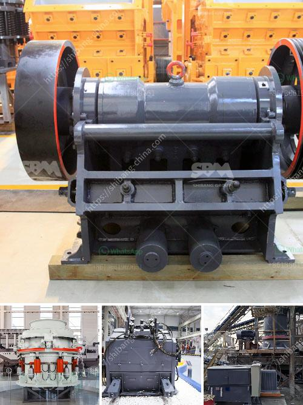

<h3>double roll rollers</h3>
Double roll rollers are a compact yet powerful construction equipment popularly used in road construction and maintenance projects. These versatile machines consist of two smooth steel drums that enable them to efficiently compact a wide range of materials such as asphalt, gravel, and soil. With their ability to operate in tight spaces and their superior compaction capabilities, double roll rollers play a crucial role in creating smooth and durable road surfaces.

One of the main advantages of double roll rollers is their compact size. Due to their small dimensions, these machines can access narrow roads and work in tight spaces that are often inaccessible to larger construction equipment. This makes double roll rollers perfect for urban construction projects where space is limited and maneuverability is essential.

Another key feature of double roll rollers is their high compaction efficiency, making them ideal for achieving a high level of compaction in a short amount of time. The two smooth drums apply pressure evenly on the material being compacted, resulting in a uniform and tightly compacted surface. This ensures that roads are constructed with the necessary density, preventing premature wear and tear and enhancing their lifespan.

Furthermore, double roll rollers are known for their versatility. They can be used for both initial compaction during road construction and for maintaining existing road surfaces. Whether it's building new roads, repairing damaged ones, or resurfacing existing highways, double roll rollers are the go-to machines for achieving optimal compaction results.

In conclusion, double roll rollers are powerful and versatile construction equipment that are essential in road construction and maintenance projects. Their compact size allows them to access confined spaces, while their high compaction efficiency ensures durable and smooth road surfaces. These rollers truly deserve their place in the construction industry, contributing to the safe and efficient transportation infrastructure that we rely on every day.
<h3>Contact us</h3><ul><li><strong>Whatsapp:&nbsp;<a href="https://wa.me/8613661969651">+8613661969651</a></strong></li><li><a href="https://swt.shibang-china.com/?git&amp;zhl&amp;double roll rollers"><strong>Online Service(chat now)</strong></a></li></ul><h3>Related</h3><ul><li><a href='sample of joint operations agreement quarry mining.md'>sample of joint operations agreement quarry mining</a></li><li><a href='sand washing plant south africa.md'>sand washing plant south africa</a></li><li><a href='low cost jaw crusher for sale in ethiopia.md'>low cost jaw crusher for sale in ethiopia</a></li><li><a href='malaysia stone crushing machine crusher for sale.md'>malaysia stone crushing machine crusher for sale</a></li><li><a href='wet and dry ball mill.md'>wet and dry ball mill</a></li></ul>