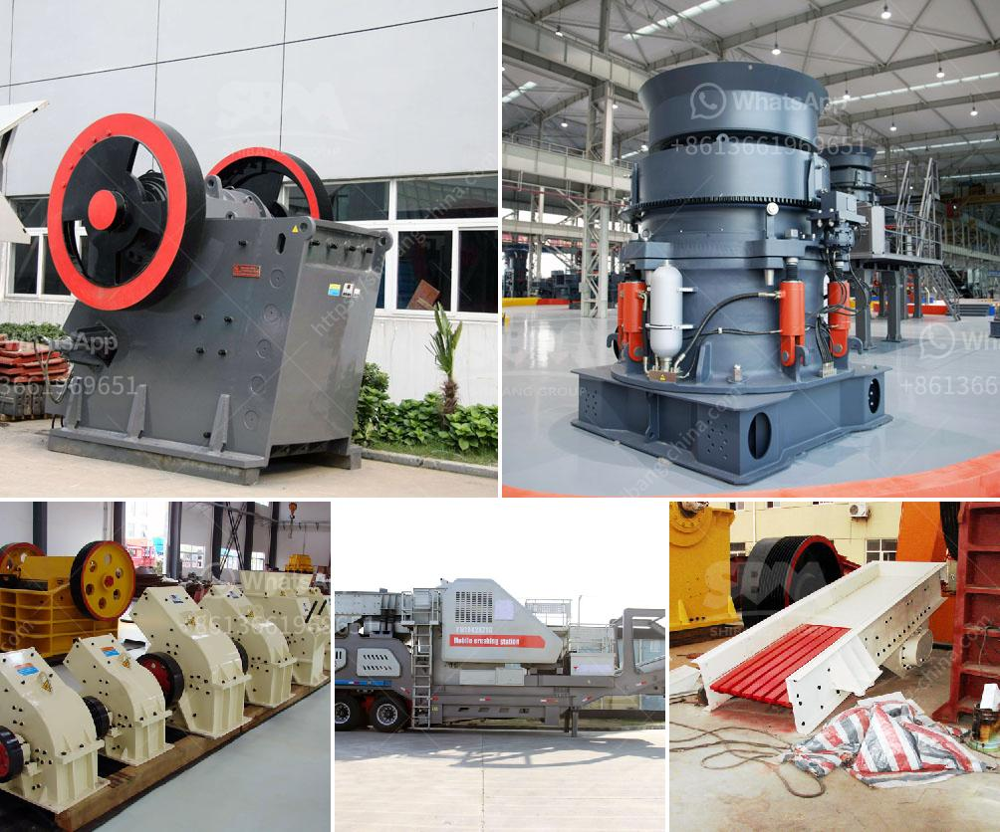

<h3>double roller crusher manufacturer</h3>
Double roller crusher, also known as roll crusher, double roll crusher, is specially used for the crushing of medium hardness material such as: coke, sinter, limestone, and a variety of metal ores and non-metallic ore. Double roller crusher is very suitable for the crushing of small and medium-sized non-metallic mining and chemical industry.

The double roller crusher machine has the advantages of small volume, large crushing ratio, low noise, simple structure and convenient maintenance. The materials crushed by roller crusher has a uniform particle size, which greatly reduces the circulating load. The wear of roller surface can be easily repaired with suitable welding material and heat treatment process, thus reducing maintenance costs and prolonging service life.

As a leading manufacturer in the crushing and milling industry, Shanghai SBM Mining and Construction Machinery Co., Ltd.(SBM) has a professional team for R&D, production, sales and service. We provide various types of double roller crusher, including 2PG series hydraulic roller crusher, double toothed roller crusher and smooth roller crusher. Customers can choose according to their actual needs.

In addition, SBM also provides complete crushing plant for the quarrying and mining industry. The crushing plant consists of vibrating feeder, jaw crusher, impact crusher, vibrating screen, belt conveyor, electric control panel, etc. Its designed throughput generally is 50-600 t/h.

Double roller crusher is suitable for crushing medium hardness materials such as limestone, slag, coke, coal, etc. in the metallurgy, building materials, chemical, industry, and power plant. Compared with other types of crushers, double roller crusher integrates the advantages of traditional jaw crusher and impact crusher, and has the combined function of the two types of crushers.

The double roller crusher rolls the materials into the gap between the two rollers by their rotating motion and the friction angle formed between the rollers and the materials. The two rollers force the materials to be compressed and crushed between them, which is mainly used to crush medium-hard and soft materials.

In summary, double roller crusher is suitable for crushing medium-hardness materials such as limestone, slag, coke, coal, etc. It has the advantages of large crushing ratio, low noise, simple structure and convenient maintenance. Double roller crusher manufacturer SBM provides various types of double roller crusher, offering customers an excellent choice for crushing small and medium-sized non-metallic mining and chemical industry. If you are interested in our products, please feel free to contact us.
<h3>Contact us</h3><ul><li><strong>Whatsapp:&nbsp;<a href="https://wa.me/8613661969651">+8613661969651</a></strong></li><li><a href="https://swt.shibang-china.com/?git&amp;zhl&amp;double roller crusher manufacturer"><strong>Online Service(chat now)</strong></a></li></ul><h3>Related</h3><ul><li><a href='granite quarry business plan pdf.md'>granite quarry business plan pdf</a></li><li><a href='ball mill with high quality and best price.md'>ball mill with high quality and best price</a></li><li><a href='quarry crusher machine price.md'>quarry crusher machine price</a></li><li><a href='high capacity r ore raymond mill with competitive price.md'>high capacity r ore raymond mill with competitive price</a></li><li><a href='quartz stone machine of india.md'>quartz stone machine of india</a></li></ul>