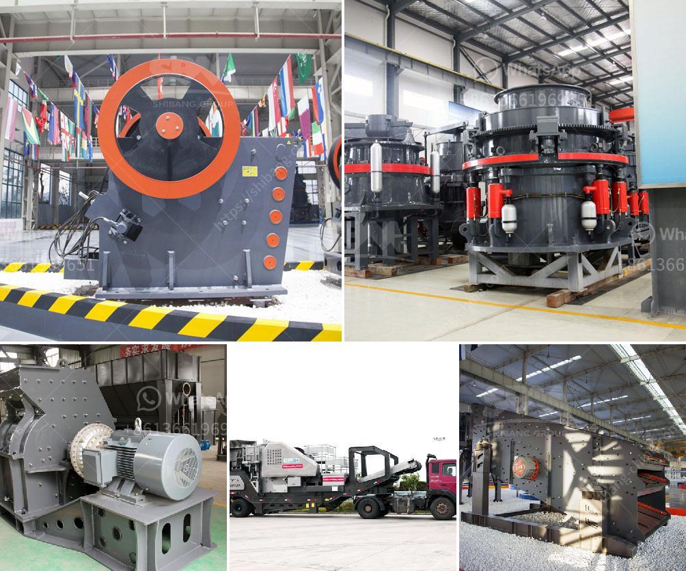

<h3>double roller stone cracher</h3>
The double roller stone crusher is an innovative equipment that uses two rollers to crush stone materials. This machine was developed in early 2020 and is widely used in various fields to process different kinds of stones, such as granite, limestone, concrete, basalt, etc.

The double roller stone crusher consists of two rollers, which rotate in opposite directions. The materials are fed into the upper roller, which operates like a traditional stone crusher, crushing the stones against a static plate. As the stones pass through the rollers, they are further crushed by the lower roller, resulting in a finer product.

One key advantage of the double roller stone crusher is its ability to produce a uniform particle size. The rollers have precise gaps that can be adjusted to control the size of the crushed stones. This feature is particularly useful in construction projects where consistent stone sizes are required.

Another notable feature of this machine is its high efficiency. The double roller stone crusher can process a large amount of materials in a short time, thus increasing productivity. Additionally, it consumes less power compared to traditional stone crushers, contributing to energy conservation.

Moreover, the double roller stone crusher is portable and easy to move, making it suitable for both on-site operations and remote locations. Its compact design allows it to be easily transported and set up wherever it is needed.

In conclusion, the double roller stone crusher is a versatile and efficient machine that offers several benefits compared to traditional stone crushers. Its ability to produce uniform and finely crushed stones, high efficiency, and portability make it a valuable tool for various industries. Whether used in construction, mining, or other fields, this equipment is a reliable solution for stone crushing needs.
<h3>Contact us</h3><ul><li><strong>Whatsapp:&nbsp;<a href="https://wa.me/8613661969651">+8613661969651</a></strong></li><li><a href="https://swt.shibang-china.com/?git&amp;zhl&amp;double roller stone cracher"><strong>Online Service(chat now)</strong></a></li></ul><h3>Related</h3><ul><li><a href='mobile crusher machine.md'>mobile crusher machine</a></li><li><a href='silica sand mining machine.md'>silica sand mining machine</a></li><li><a href='gyratory cone crusher manufacturers china.md'>gyratory cone crusher manufacturers china</a></li><li><a href='jaw crusher machine in south africa.md'>jaw crusher machine in south africa</a></li><li><a href='crushing plant in pakistan.md'>crushing plant in pakistan</a></li></ul>