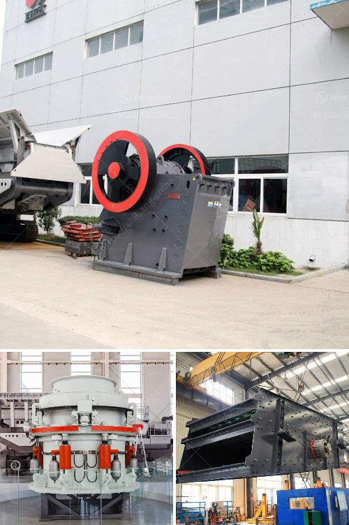

<h3>double stage hammer crusher for stone</h3>
The double stage hammer crusher is one of the most efficient and commonly used stone crushing machines in the market today. It is mainly used for crushing materials with compressive strength which is no more than 200MPa and the discharging size is no more than 25mm. The double stage hammer crusher's working principle is that the rotor has two different rotation directions, crushing materials at the same time, resulting in a high crushing efficiency. The double stage hammer crusher consists of a rotor assembly, a hammer, a star rack, a drive system, and a housing.

The rotor assembly is the main working part of the crusher, the rotor is composed of spindle, hammer disc, hammer head, hammer shaft, and other parts. The rotor rotates at high speed under the drive of the motor, and the materials entered from the upper feed port are quickly crushed by the impact, shear, and grinding of the hammer head on the high-speed rotating rotor, and then discharged through the sieve plate at the lower part of the chamber.

One of the distinguishing features of the double stage hammer crusher is that it has two stages of crushing. The first stage of crushing is achieved by the use of impact, which uses the impact force generated when the rotor rotates at high speed to crush the materials. The second stage of crushing is achieved by the use of shear and grinding, where the materials are further crushed by the interaction between the hammer disc and the hammer head, and the materials are repeatedly impacted, sheared, and ground until they achieve the desired size.

The double stage hammer crusher has many unique advantages. Firstly, it has a large crushing ratio, with maximum crushing efficiency. Secondly, the double stage hammer crusher has simple structure, compact size, and excellent crushing ability. Thirdly, the double stage hammer crusher is environmentally friendly, as it produces less dust, noise, and vibration during operation. Additionally, it has a low energy consumption, which reduces the cost of electricity consumption. Lastly, it has a wide application range, suitable for crushing various materials, such as limestone, coal, salt, gypsum, brick, and other materials with medium hardness.

In conclusion, the double stage hammer crusher is an efficient and cost-effective stone crushing machine that is widely used in the industry. It is suitable for crushing various materials with a compressive strength of no more than 200MPa and a particle size of no more than 25mm. Its unique design and working principle ensure high crushing efficiency, low energy consumption, and environmentally friendly operation. Whether it is used in mining, metallurgy, building materials, or other industries, the double stage hammer crusher is a reliable choice for stone crushing.
<h3>Contact us</h3><ul><li><strong>Whatsapp:&nbsp;<a href="https://wa.me/8613661969651">+8613661969651</a></strong></li><li><a href="https://swt.shibang-china.com/?git&amp;zhl&amp;double stage hammer crusher for stone"><strong>Online Service(chat now)</strong></a></li></ul><h3>Related</h3><ul><li><a href='mini crushers for sale.md'>mini crushers for sale</a></li><li><a href='sand sieve machine.md'>sand sieve machine</a></li><li><a href='crusher machine bottlecrusher machine bottles.md'>crusher machine bottlecrusher machine bottles</a></li><li><a href='price pe 600 900 stone crusher.md'>price pe 600 900 stone crusher</a></li><li><a href='3 roller raymond mill.md'>3 roller raymond mill</a></li></ul>