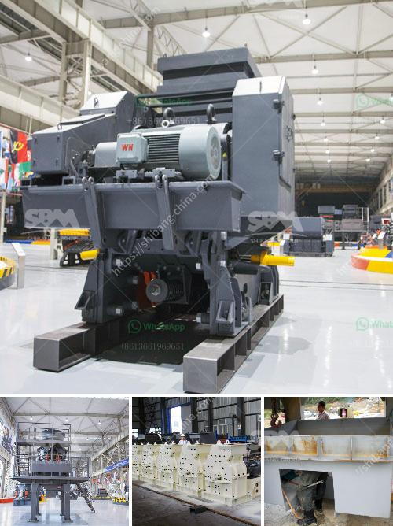

<h3>dry grinding ball mill</h3>
Dry grinding ball mill is a key equipment to grind the crushed materials. It is widely used in cement, silicate, new building material, refractory material, fertilizer, ferrous metal, nonferrous metal and glass ceramics. With the increasing demand for dry grinding, ball mills are available in various sizes to suit different requirements. 

The dry grinding process is achieved by the movement of the grinding media, which can be a steel ball or a steel rod. The material to be ground is fed from the left through a 60° cone and the product is discharged through a 30° cone at the right side. The grinding media are lifted and then fall down due to the rotation of the mill. The material is ground by the friction and impact between the balls and the grinding material.

Dry grinding ball mills have several advantages. Firstly, they are cost-effective, as they consume less power and produce less heat during the grinding process. This results in lower energy consumption and lower operational costs. Secondly, dry grinding ball mills are more environmentally friendly, as they do not require water for grinding. This saves valuable resources and reduces the environmental impact. 

Furthermore, dry grinding ball mills can achieve higher production rates compared to traditional wet grinding methods. This is because the grinding media are able to move more freely inside the mill, resulting in a higher impact force and a faster grinding process. Additionally, dry grinding ball mills are versatile, as they can grind a wide variety of materials, including ores, chemicals, ceramic raw materials, and paints.

In conclusion, dry grinding ball mills are an efficient and versatile grinding solution, suitable for various industries. They offer numerous advantages, including lower energy consumption, reduced operational costs, and environmental benefits. As a result, dry grinding ball mills are becoming increasingly popular in the industry.
<h3>Contact us</h3><ul><li><strong>Whatsapp:&nbsp;<a href="https://wa.me/8613661969651">+8613661969651</a></strong></li><li><a href="https://swt.shibang-china.com/?git&amp;zhl&amp;dry grinding ball mill"><strong>Online Service(chat now)</strong></a></li></ul><h3>Related</h3><ul><li><a href='gold mining crushing and milling machine.md'>gold mining crushing and milling machine</a></li><li><a href='dolomite grinding mill for sale in india.md'>dolomite grinding mill for sale in india</a></li><li><a href='grinding mill machine price in chennai.md'>grinding mill machine price in chennai</a></li><li><a href='nigeria hammer mill.md'>nigeria hammer mill</a></li><li><a href='bauxite screening machine.md'>bauxite screening machine</a></li></ul>