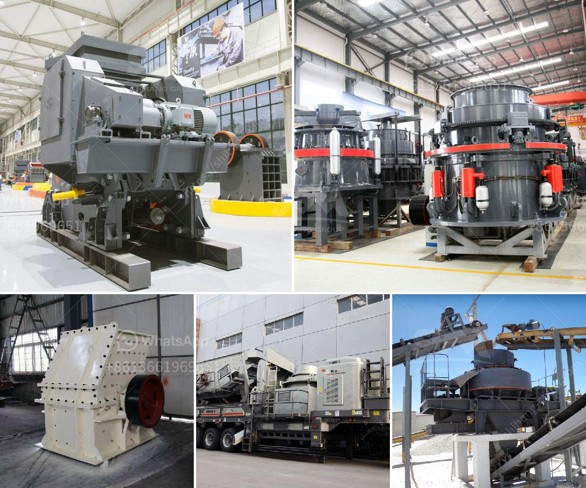

<h3>drywall grinding for gypsum</h3>
Drywall, also known as gypsum board or plasterboard, is a common material used in construction for walls and ceilings. It is made of a layer of gypsum sandwiched between two layers of paper. While drywall installation is a relatively easy DIY project, it often requires some finishing touches to achieve a smooth and seamless finish. One of the necessary steps in this process is drywall grinding.

Drywall grinding involves using a specialized power tool called a drywall sander or a hand-held drywall grinder. These tools have a rotating sanding pad covered in abrasive paper, which smooths out rough spots and excess joint compound on the surface of the drywall. The grinding process creates a fine gypsum dust that can easily be inhaled, which is why safety precautions such as wearing a mask and goggles are essential.

There are several reasons why drywall grinding may be necessary. Firstly, it helps to achieve a level surface for painting or wallpaper application. Even after careful installation, there can be visible seams and imperfections that need to be smoothed out. Secondly, grinding enables the removal of high spots or ridges created during the taping and mudding process. These uneven surfaces can affect the appearance and finish of the final product. Lastly, grinding can also be used to remove stubborn layers of old paint or wallpaper adhesive.

Drywall grinding can be time-consuming and messy, particularly if not done correctly. It is important to contain the gypsum dust by setting up dust barriers or working in a well-ventilated area. Additionally, it is crucial to clean up thoroughly after grinding to eliminate any dust particles that may have settled on furniture or fixtures.

In conclusion, drywall grinding is a necessary step in achieving a smooth and professional finish. Whether it's for preparing the surface for painting or wallpaper application, or to eliminate imperfections and ridges, grinding can make a significant difference in the final appearance of the drywall. However, it is important to follow safety precautions and proper cleanup procedures to avoid any health hazards associated with inhaling gypsum dust.
<h3>Contact us</h3><ul><li><strong>Whatsapp:&nbsp;<a href="https://wa.me/8613661969651">+8613661969651</a></strong></li><li><a href="https://swt.shibang-china.com/?git&amp;zhl&amp;drywall grinding for gypsum"><strong>Online Service(chat now)</strong></a></li></ul><h3>Related</h3><ul><li><a href='aggregate washing screens in south africa.md'>aggregate washing screens in south africa</a></li><li><a href='micro fine grinding mill.md'>micro fine grinding mill</a></li><li><a href='coal mining processes and machinary required.md'>coal mining processes and machinary required</a></li><li><a href='double roller stone cracher.md'>double roller stone cracher</a></li><li><a href='manganese ore mining processing process equipment.md'>manganese ore mining processing process equipment</a></li></ul>