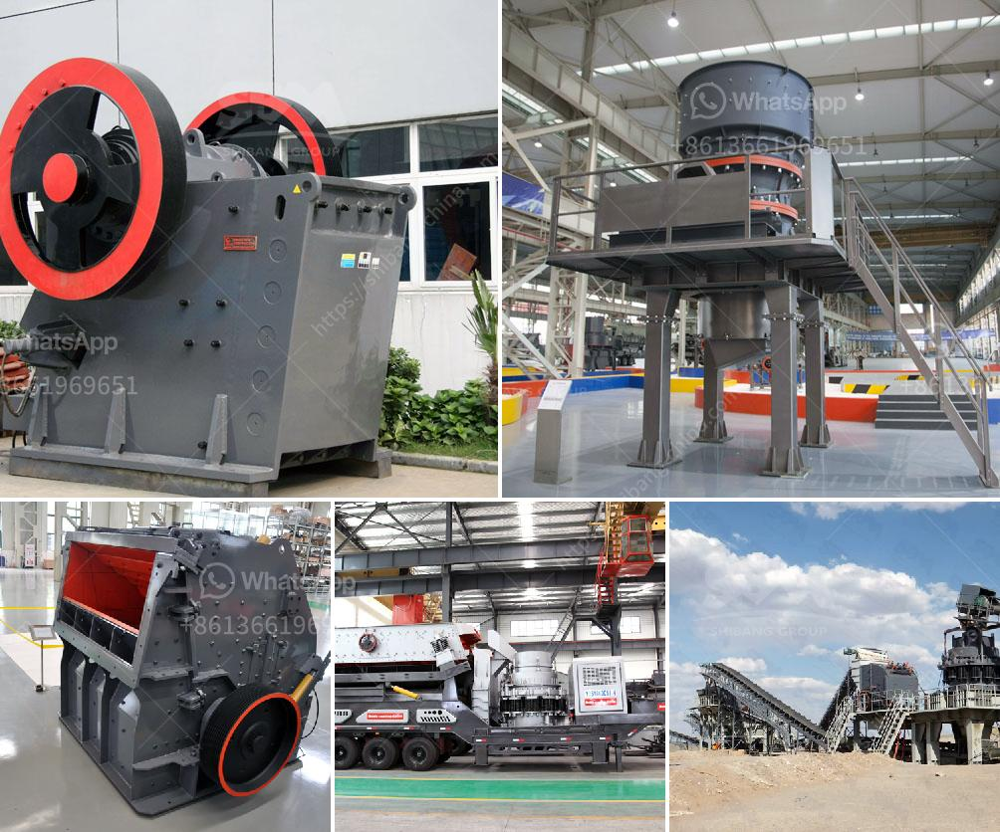

<h3>dubai stone crushing auction</h3>
Dubai, the city of dreams and one of the fastest-growing urban centers in the world, is no stranger to construction projects. With its stunning skyline and ambitious infrastructure projects, the demand for building materials has skyrocketed. As the construction industry continues to thrive, so does the need for an efficient and sustainable solution for sourcing these materials. That is where Dubai stone crushing auctions come into play.

Stone crushing auctions have gained significant popularity in recent years due to their ability to provide a sustainable and cost-effective solution for acquiring construction materials. These auctions offer a wide variety of stones, ranging from limestone and granite to marble and sandstone, all of which are crucial components in the construction process.

One of the key advantages of Dubai stone crushing auctions is the accessibility and convenient location of these auctions. They are typically held in easily accessible areas, making it easier for construction companies to participate. Additionally, these auctions ensure a transparent and fair bidding process, ensuring that the best value is obtained by the buyers.

In addition to accessibility, these stone crushing auctions offer a wide range of stones, catering to the diverse needs of the construction industry. Due to Dubai's strategic location, these auctions often attract suppliers from neighboring countries who offer unique stones that are not easily available locally. This not only adds variety to the bidding process but also encourages healthy competition among bidders, resulting in better outcomes for both buyers and suppliers.

Moreover, stone crushing auctions in Dubai promote sustainability in the construction industry. By recycling and reusing stones from demolished buildings, these auctions contribute to reducing the environmental impact associated with quarrying and mining activities. This approach aligns with the UAE's commitment to sustainable development, as stated in its Vision 2021, which aims to create a sustainable and well-planned environment for future generations.

Furthermore, Dubai stone crushing auctions offer significant cost savings for construction companies. By purchasing stones through these auctions, companies can bypass middlemen and source materials directly from the suppliers. This eliminates additional costs, making construction projects more economically viable.

As the demand for construction materials continues to grow, Dubai stone crushing auctions are expected to play an even more crucial role in the industry. They contribute towards fostering a sustainable approach to construction, while also ensuring efficient material sourcing and cost-saving benefits.

In conclusion, Dubai stone crushing auctions provide a sustainable and efficient solution for construction material sourcing. These auctions offer accessible locations, a diverse range of stones, and a transparent bidding process, all while promoting sustainability and cost savings. As the construction industry in Dubai continues to flourish, these stone crushing auctions are set to become an integral part of the building process, ensuring a sustainable future for the city and beyond.
<h3>Contact us</h3><ul><li><strong>Whatsapp:&nbsp;<a href="https://wa.me/8613661969651">+8613661969651</a></strong></li><li><a href="https://swt.shibang-china.com/?git&amp;zhl&amp;dubai stone crushing auction"><strong>Online Service(chat now)</strong></a></li></ul><h3>Related</h3><ul><li><a href='stone crusher plant 80 ton.md'>stone crusher plant 80 ton</a></li><li><a href='used aggregate crushing plant for sale.md'>used aggregate crushing plant for sale</a></li><li><a href='german technology ball grinding machine.md'>german technology ball grinding machine</a></li><li><a href='project cost of clinker grinding unit.md'>project cost of clinker grinding unit</a></li><li><a href='hammers mill machine.md'>hammers mill machine</a></li></ul>