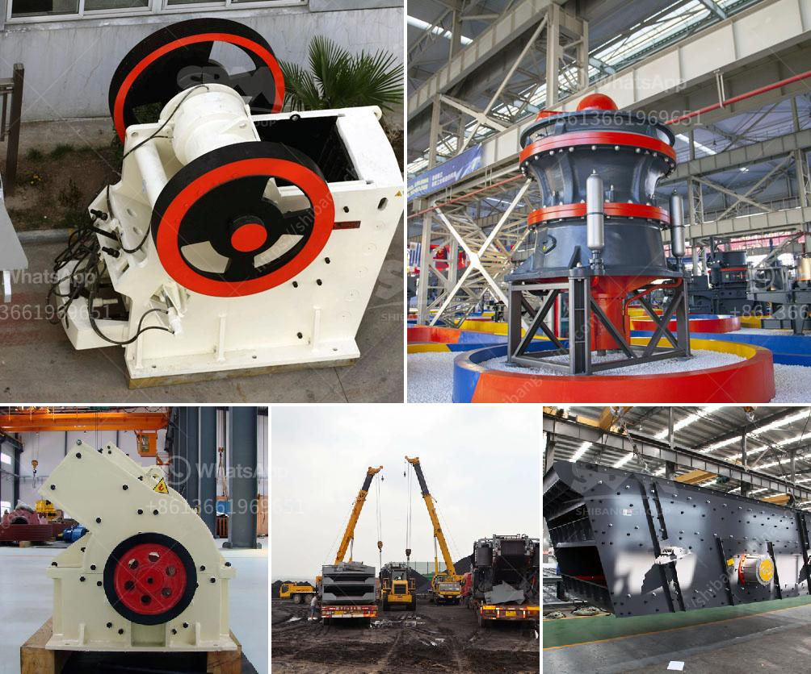

<h3>easy operation kaolin grinding mill</h3>
Kaolin, also known as china clay, is a white, soft, and plastic clay mineral that is commonly used for its various industrial applications. One of the most important uses of kaolin is in the production of ceramics, where it is used as a filler and a coating material. In order to effectively utilize kaolin, it needs to be processed and ground into fine particles. This is where the kaolin grinding mill comes into play.

The kaolin grinding mill is a device that is used to grind the kaolin mineral into fine powder. As a professional manufacturer of kaolin grinding mills, we provide a wide range of grinding equipment for both wet and dry grinding applications. The easy operation kaolin grinding mill is user-friendly and does not require any specialized skills or training to operate it.

One of the key features of the easy operation kaolin grinding mill is its high grinding efficiency. The mill is designed to grind the kaolin mineral into fine particles, which ensures the high quality of the final product. Additionally, the mill is equipped with advanced technology and has a high grinding capacity, which means that it can process a large amount of kaolin in a short period of time.

Another advantage of the easy operation kaolin grinding mill is its versatility. The mill can be used for grinding various types of kaolin minerals, including hard kaolin, soft kaolin, and sandy kaolin. This makes it suitable for a wide range of applications, such as the production of ceramics, paints, plastics, rubber, and paper.

Furthermore, the easy operation kaolin grinding mill is designed to be energy-efficient and environmentally friendly. It consumes less power and produces less noise and dust compared to traditional grinding mills. This not only reduces the operating costs but also minimizes the impact on the environment.

In conclusion, the easy operation kaolin grinding mill is an essential tool for processing and grinding kaolin minerals. Its high grinding efficiency, versatility, and environmental friendliness make it a preferred choice for industries that require fine grinding of kaolin. Whether you are a small-scale manufacturer or a large industrial plant, the easy operation kaolin grinding mill can meet your production needs effectively.
<h3>Contact us</h3><ul><li><strong>Whatsapp:&nbsp;<a href="https://wa.me/8613661969651">+8613661969651</a></strong></li><li><a href="https://swt.shibang-china.com/?git&amp;zhl&amp;easy operation kaolin grinding mill"><strong>Online Service(chat now)</strong></a></li></ul><h3>Related</h3><ul><li><a href='suppliers of jaw crushers in south africa.md'>suppliers of jaw crushers in south africa</a></li><li><a href='grinding mill machine in zimbabwe.md'>grinding mill machine in zimbabwe</a></li><li><a href='production line for calcium carbonate.md'>production line for calcium carbonate</a></li><li><a href='small stone crushing machine.md'>small stone crushing machine</a></li><li><a href='service de carbonate de calcium de broyage.md'>service de carbonate de calcium de broyage</a></li></ul>