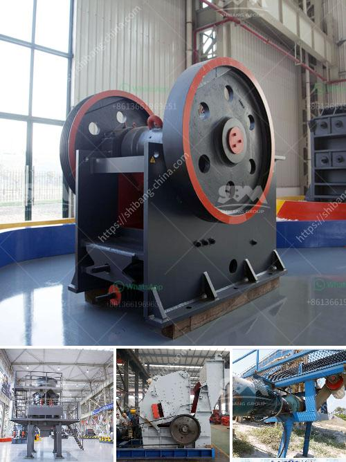

<h3>economic analysis of conveyor system</h3>
Conveyor systems play a crucial role in various industries, enabling the efficient movement of goods and materials from one location to another. These systems are composed of belts, rollers, and other mechanical components that automate the transportation of items, saving time and labor costs. In this article, we will conduct an economic analysis of conveyor systems and explore their benefits for businesses.

One of the key advantages of utilizing conveyor systems is the significant reduction in labor costs. Manual transportation of materials can be time-consuming and requires a significant workforce. Conveyors, on the other hand, can handle high volumes of items with minimal human intervention, leading to lower labor requirements and associated expenses.

In addition to labor savings, conveyor systems also enhance productivity. By automating material handling processes, businesses can streamline their operations and increase the throughput rate. This results in faster production cycles and improved overall efficiency. Higher productivity enables businesses to meet customer demands more effectively and potentially gain a competitive edge in the market.

Another economic advantage of conveyor systems is the reduction in product damage. Manual handling of fragile or delicate items can lead to breakages and losses. Conveyors, designed with appropriate belts, rollers, and control systems, ensure gentle and controlled transportation, minimizing the risk of product damage. Reducing product loss and enhancing quality control can contribute to cost savings and customer satisfaction.

Moreover, conveyor systems provide flexibility and adaptability to changing production requirements. The modular design of these systems allows for easy customization and reconfiguration. As businesses evolve and grow, they can modify their conveyor systems to accommodate new layouts or product lines. This adaptability prevents the need for complete system replacements, saving capital expenditure in the long run.

From a financial standpoint, the initial investment in conveyor systems may seem significant. However, it is crucial to consider the long-term benefits and cost savings they bring. The return on investment (ROI) for a conveyor system can be calculated based on factors such as labor cost savings, productivity gains, reduced product damage, and operational efficiency improvements. While individual ROI figures will vary based on specific circumstances, many businesses find that the long-term cost advantages of conveyor systems outweigh the initial investment.

Additionally, conveyor systems contribute to workplace safety, which has direct economic implications. Manual material handling often involves heavy lifting, which can lead to injuries and workers' compensation claims. By automating material transportation, conveyor systems minimize the risk of workplace accidents, improving employee safety and reducing associated medical and legal costs.

In conclusion, an economic analysis of conveyor systems demonstrates their significant benefits for businesses. These systems offer labor cost savings, increased productivity, reduced product damage, flexibility, and workplace safety. While the initial investment may be substantial, the long-term advantages, including cost savings and operational efficiency improvements, make conveyor systems a valuable asset for various industries.
<h3>Contact us</h3><ul><li><strong>Whatsapp:&nbsp;<a href="https://wa.me/8613661969651">+8613661969651</a></strong></li><li><a href="https://swt.shibang-china.com/?git&amp;zhl&amp;economic analysis of conveyor system"><strong>Online Service(chat now)</strong></a></li></ul><h3>Related</h3><ul><li><a href='jual stone crusher portable.md'>jual stone crusher portable</a></li><li><a href='mineral crusher processing plants china.md'>mineral crusher processing plants china</a></li><li><a href='metal detector for iron ore crushing plant.md'>metal detector for iron ore crushing plant</a></li><li><a href='gold ore processing plant in germany.md'>gold ore processing plant in germany</a></li><li><a href='barite grinding machine manufacturer.md'>barite grinding machine manufacturer</a></li></ul>