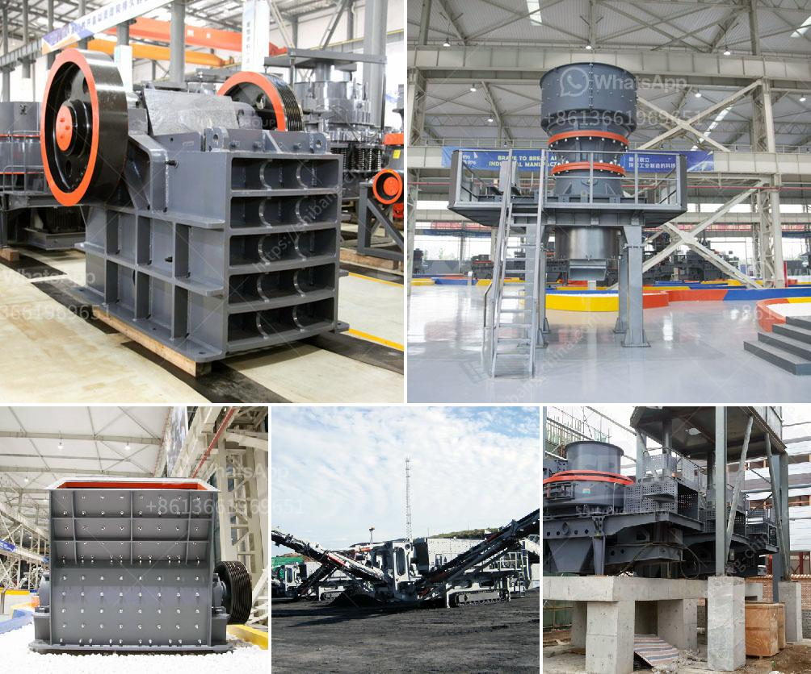

<h3>enquiry about jaw crusher</h3>
A jaw crusher is a primary crushing machine used for a variety of tasks in many industries. Various product sizes can be produced using this machine, thanks to its capability to crush large rocks into smaller pieces. Jaw crushers are typically used in mining, metallurgy, construction, railway, water conservancy, and chemical industries.

When considering purchasing a jaw crusher or any other crushing equipment, conducting an enquiry becomes crucial. Enquiring about a jaw crusher allows potential buyers to gather relevant information to make an informed decision. Here are a few key factors to consider when making an enquiry about a jaw crusher:

1. Capacity: Understanding the required capacity is essential as it helps ensure that the crusher can handle the intended workload. The capacity required may vary depending on the type of material being crushed and the desired output size.

2. Power: The power capacity of the jaw crusher should also be taken into consideration. It is crucial to ensure that the crusher has enough power to efficiently crush the materials at the desired capacity.

3. Maintenance and service: Enquiring about the maintenance and service requirements of the jaw crusher is essential for long-term operations. Understanding the frequency and nature of routine maintenance, as well as availability and cost of spare parts, can help avoid unexpected downtime and maintenance costs.

4. Safety features: Safety is of utmost importance in any industrial setting. Therefore, enquiring about the safety features incorporated in the jaw crusher is crucial. It is essential to understand the safety mechanisms, emergency stop buttons, and any additional features that ensure the safety of the operators.

5. Price and delivery time: Finally, it is important to enquire about the price and delivery time of the jaw crusher. This information will help potential buyers make an informed decision based on their budget and timeline.

In conclusion, enquiring about a jaw crusher is a crucial step in the purchasing process. It helps potential buyers gather information about the machine's capacity, power, maintenance requirements, safety features, price, and delivery time. Taking into account these factors will ensure a well-informed decision and a successful investment in the right equipment for the job.
<h3>Contact us</h3><ul><li><strong>Whatsapp:&nbsp;<a href="https://wa.me/8613661969651">+8613661969651</a></strong></li><li><a href="https://swt.shibang-china.com/?git&amp;zhl&amp;enquiry about jaw crusher"><strong>Online Service(chat now)</strong></a></li></ul><h3>Related</h3><ul><li><a href='petroleum coke grinding.md'>petroleum coke grinding</a></li><li><a href='limestone crushing plant.md'>limestone crushing plant</a></li><li><a href='setting up limestone processing plant in nigeria.md'>setting up limestone processing plant in nigeria</a></li><li><a href='cone crusher that is a cone crusher.md'>cone crusher that is a cone crusher</a></li><li><a href='stone crushing machine in zambia.md'>stone crushing machine in zambia</a></li></ul>