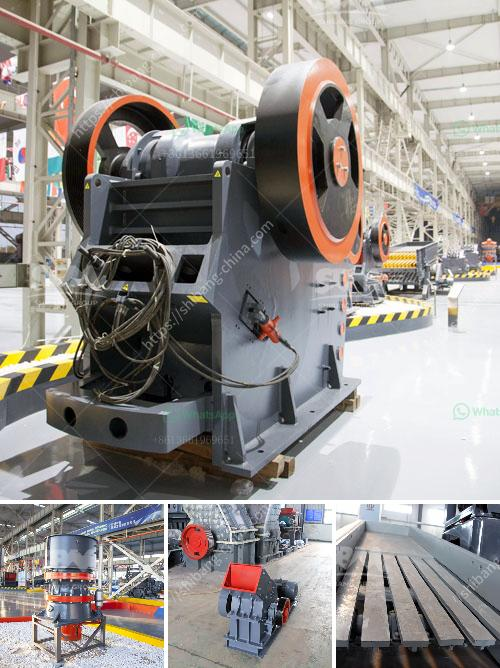

<h3>equipment for gold mine tailings in ghana</h3>
Ghana is a country rich in natural resources, with gold being a major contributor to its economy. The mining industry in Ghana is thriving, with artisanal miners using rudimentary methods for extracting gold from the tailings left behind by large-scale mining companies. However, with the increasing demand for gold and the need to minimize environmental damage, there is a growing requirement for specialized equipment to efficiently extract gold from mine tailings in Ghana.

Mine tailings are the waste materials left behind after the extraction of desired minerals from ore. These tailings often contain substantial amounts of gold that were not successfully captured during the initial extraction process. The challenge lies in separating the tiny gold particles from other unwanted materials. Traditional methods such as manual panning and sluicing are time-consuming, labor-intensive, and do not yield optimal results.

To address these issues, modern equipment has been developed to extract gold from tailings effectively. One such equipment is the gold centrifugal concentrator. This device uses centrifugal force to separate gold particles from other materials in the tailings. It works by spinning the tailings in a rotating drum while water is added to create a slurry. The heavier gold particles settle to the bottom of the drum due to centrifugal force, allowing for easy collection.

Another effective solution is the use of gold shaking tables. These tables rely on gravity and vibrations to separate gold particles from the tailings. The vibrating motion of the table causes gold particles to settle in the riffles, while the lighter materials are washed away. This equipment is highly efficient and can process large volumes of tailings, making it suitable for industrial-scale operations.

Additionally, gold dredges have proved to be valuable equipment for extracting gold from tailings in Ghana. These machines use suction to remove sediment from riverbeds or underwater deposits, including tailings ponds. Gold dredges can process large amounts of material, enabling efficient gold recovery. They are particularly useful in areas where access to tailings is limited or where tailings are submerged underwater.

Apart from these specialized machines, other equipment such as crushers, screens, and pumps are also crucial for the extraction process. Crushers are used to break down large chunks of tailings into smaller pieces, making it easier to extract gold particles. Screens help separate different-sized materials, while pumps are used to transfer water and slurry between different stages of the gold extraction process.

Integrating modern equipment into the gold mining industry in Ghana is essential for sustainable and responsible gold extraction. While artisanal miners have contributed significantly to Ghana's gold production, they often lack the resources and knowledge to effectively recover gold from tailings. By utilizing specialized equipment, the efficiency and effectiveness of gold recovery can be greatly improved, leading to increased productivity and reduced environmental impact.

In conclusion, the extraction of gold from mine tailings in Ghana can be enhanced by the use of modern equipment. Gold centrifugal concentrators, shaking tables, and gold dredges are some of the machinery that can optimize the gold recovery process. Investing in these machines will not only boost gold production but also promote sustainable mining practices in Ghana.
<h3>Contact us</h3><ul><li><strong>Whatsapp:&nbsp;<a href="https://wa.me/8613661969651">+8613661969651</a></strong></li><li><a href="https://swt.shibang-china.com/?git&amp;zhl&amp;equipment for gold mine tailings in ghana"><strong>Online Service(chat now)</strong></a></li></ul><h3>Related</h3><ul><li><a href='crusher peru price.md'>crusher peru price</a></li><li><a href='supplier of vibrating screen in philippines.md'>supplier of vibrating screen in philippines</a></li><li><a href='industrial mineral silica sand.md'>industrial mineral silica sand</a></li><li><a href='powder making machine south africa.md'>powder making machine south africa</a></li><li><a href='setting up of a stone quarry plant in nigeria.md'>setting up of a stone quarry plant in nigeria</a></li></ul>